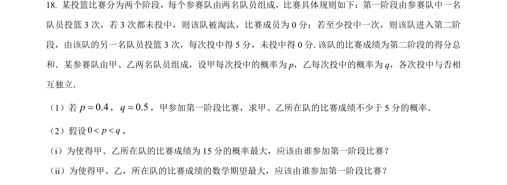
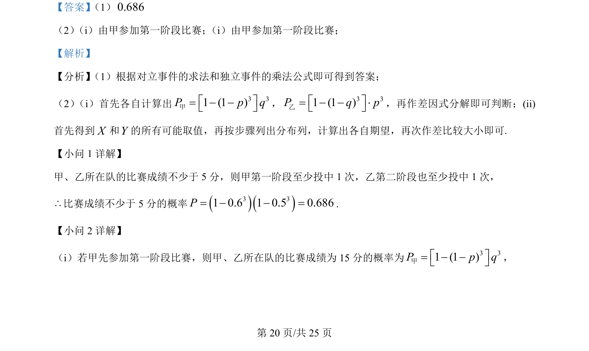
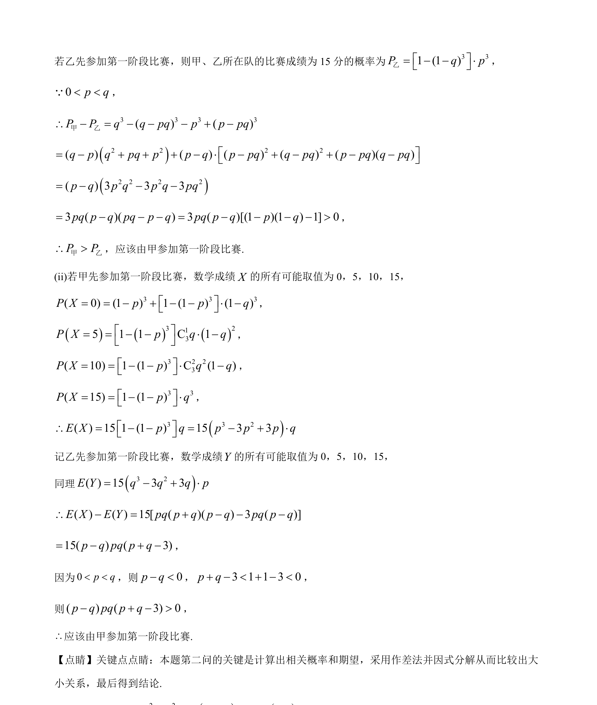

## 题面

## 摘要

本题通过比赛投篮情境考查独立事件概率计算、分布列与期望的求法及作差比较大小。

## 关联考点

- [[317-事件的关系运算|对立事件]]
- [[986-独立事件的乘法公式|独立事件的乘法公式]]
- [[1184-分布列与期望|分布列与期望]]
- [[1157-作差比较|作差比较]]

## 答案与解析

> 📄 原 PDF 第 20 页：`素材/真题/吉林/2008-2024·（吉林）数学高考真题/2024年高考数学试卷（新课标Ⅱ卷）（解析卷）.pdf`

<!-- 题干文本-start -->
## 题干文本
18. 某投篮比赛分为两个阶段，每个参赛队由两名队员组成，比赛具体规则如下：第一阶段由参赛队中一名
队员投篮 3 次，若 3 次都未投中，则该队被淘汰，比赛成员为 0 分；若至少投中一次，则该队进入第二阶
段，由该队的另一名队员投篮 3 次，每次投中得 5 分，未投中得 0 分.该队的比赛成绩为第二阶段的得分总
和．某参赛队由甲、乙两名队员组成，设甲每次投中的概率为 p，乙每次投中的概率为 q，各次投中与否相
互独立．
（1）若0.4p=，0.5q=，甲参加第一阶段比赛，求甲、乙所在队的比赛成绩不少于 5 分的概率．
（2）假设0p q< <，
（i）为使得甲、乙所在队的比赛成绩为 15 分的概率最大，应该由谁参加第一阶段比赛？
（ii）为使得甲、乙，所在队的比赛成绩的数学期望最大，应该由谁参加第一阶段比赛？
<!-- 题干文本-end -->

<!-- 解析文本-start -->
## 解析文本
【答案】 （1）0.686    
（2） （i）由甲参加第一阶段比赛； （i）由甲参加第一阶段比赛；
【解析】
【分析】 （1）根据对立事件的求法和独立事件的乘法公式即可得到答案；
（2） （i）首先各自计算出 3 31 (1 )P p qé ù= - -ë û甲， 3 31 (1 )P q pé ù= - - ×ë û乙，再作差因式分解即可判断； (ii)
首先得到X和Y的所有可能取值，再按步骤列出分布列，计算出各自期望，再次作差比较大小即可.
【小问 1 详解】
甲、乙所在队的比赛成绩不少于 5 分，则甲第一阶段至少投中 1 次，乙第二阶段也至少投中 1 次，
\比赛成绩不少于 5 分的概率3 31 0.6 1 0.5 0.686P= - - =.
【小问 2 详解】
（i）若甲先参加第一阶段比赛，则甲、乙所在队的比赛成绩为 15 分的概率为 3 31 (1 )P p qé ù= - -ë û甲，
<!-- 解析文本-end -->
