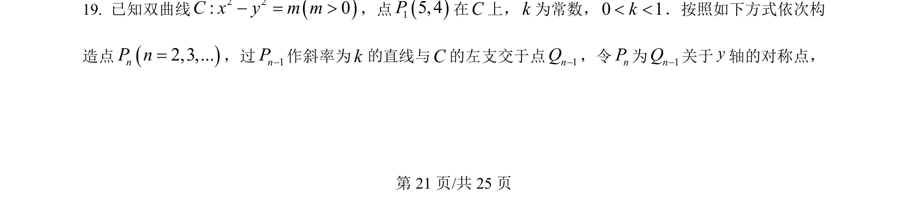
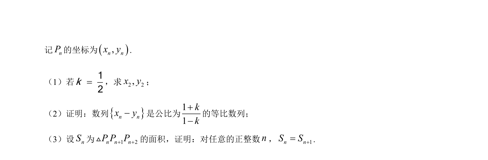
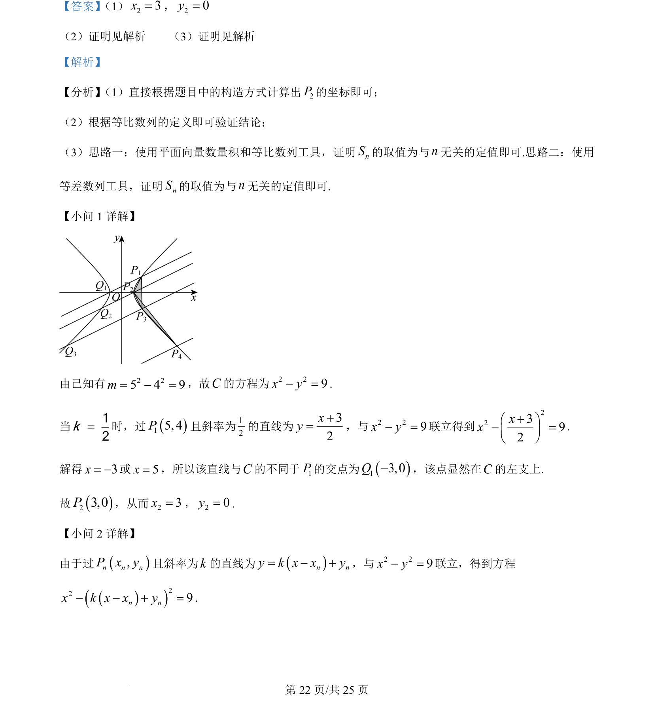
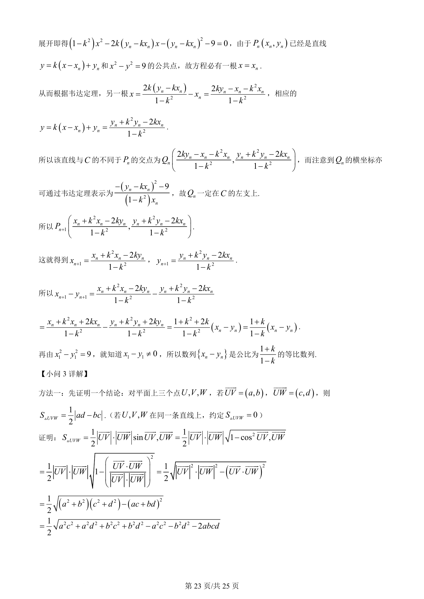
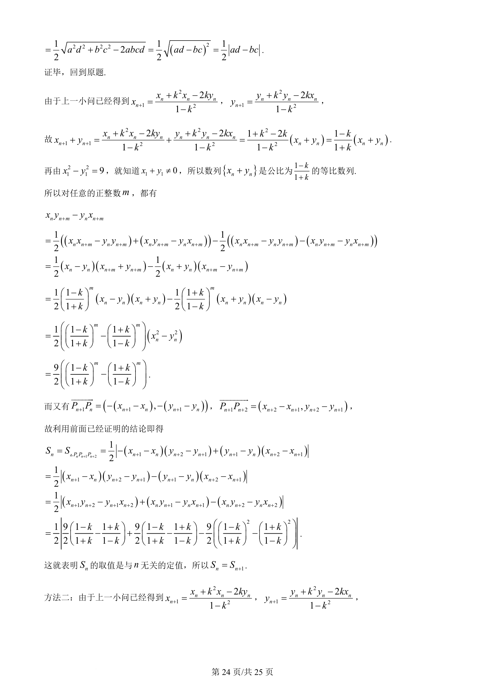
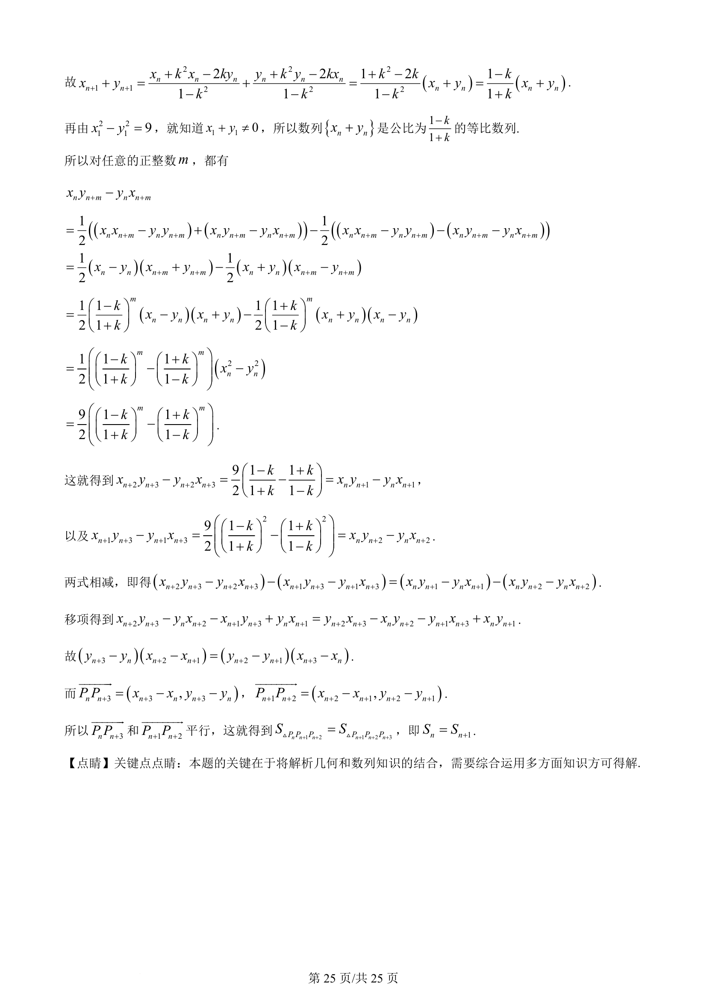

## 题面

## 摘要

本题通过双曲线上已知点与斜率递推构造对称点列，考查直线与双曲线位置关系及几何变换。

## 关联考点

- [[双曲线方程]]
- [[直线方程]]
- [[对称性]]
- [[383-数列递推公式|递推关系]]

## 答案与解析

> 📄 原 PDF 第 21 页：`素材/真题/吉林/2008-2024·（吉林）数学高考真题/2024年高考数学试卷（新课标Ⅱ卷）（解析卷）.pdf`
