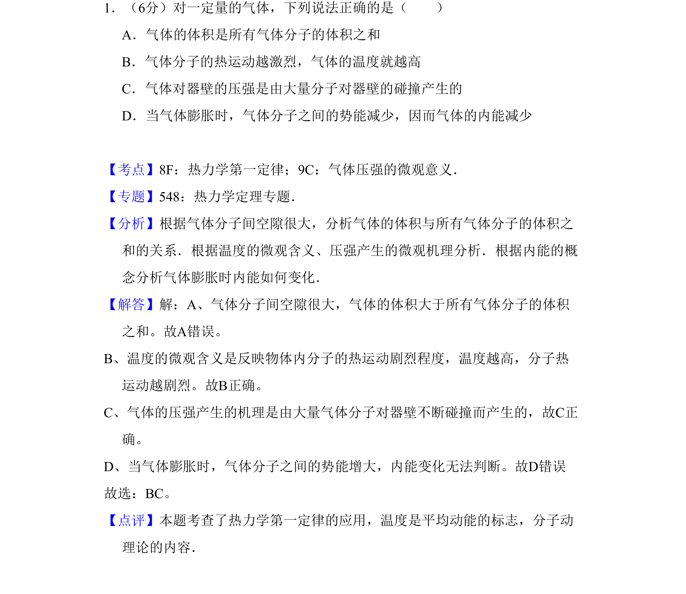
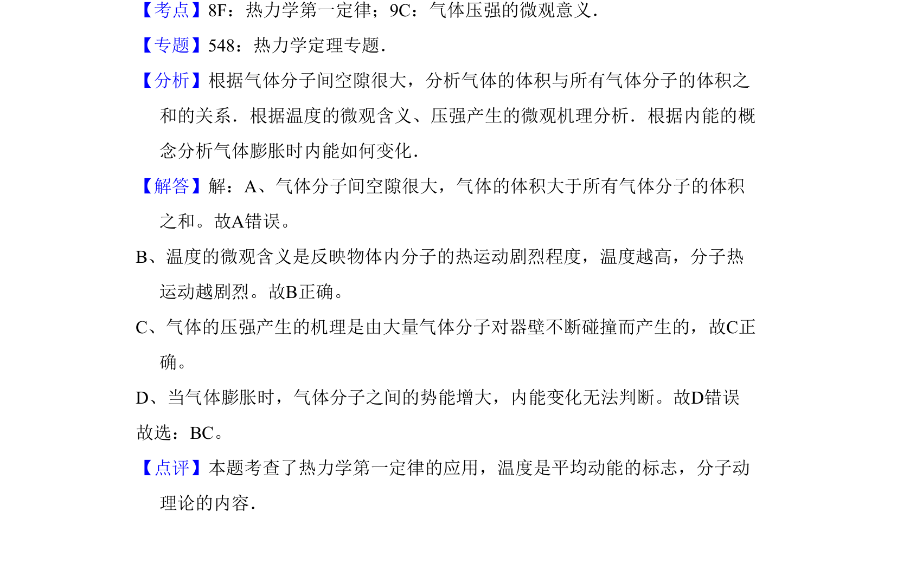

## 题面

## 摘要

气体体积与分子体积关系、温度微观含义、压强微观机制、内能变化判断

## 关联考点

- [[气体压强微观意义]]
- [[温度的微观含义]]
- [[440-热力学第一定律|热力学第一定律]]
- [[127-内能|内能]]

## 答案与解析

> 📄 原 PDF 第 1 页：`素材/真题/吉林/2008-2024·（吉林）物理高考真题/2008年高考物理试卷（全国卷Ⅱ）（解析卷）.pdf`
