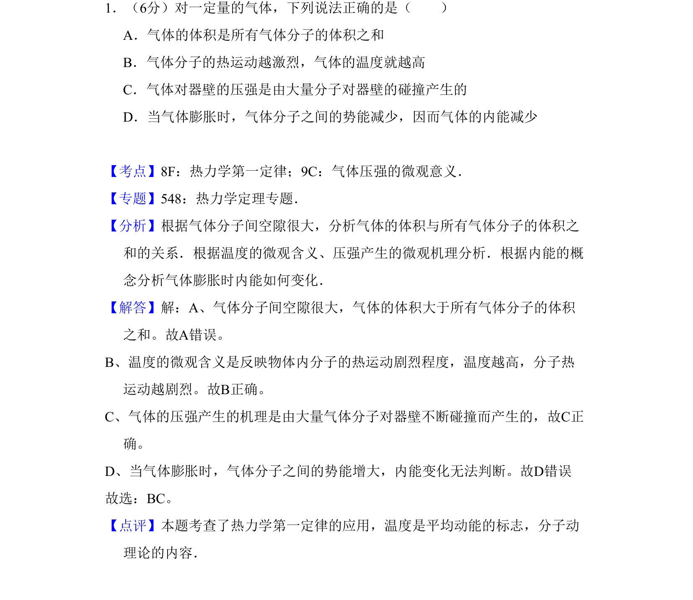
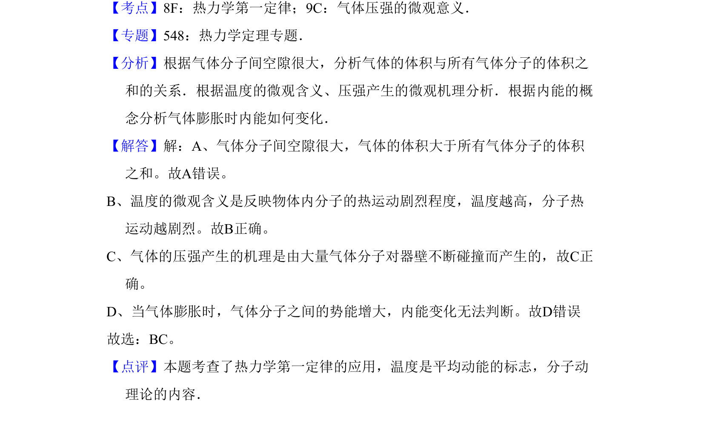

## 题面

## 摘要

气体体积与分子体积关系、温度微观含义、压强微观机制、内能变化判断

## 关联考点

- [[637-气体压强微观意义|气体压强微观意义]]
- [[655-温度的微观含义|温度的微观含义]]
- [[440-热力学第一定律|热力学第一定律]]
- [[127-内能|内能]]

## 答案与解析

> 📄 原 PDF 第 1 页：`素材/真题/吉林/2008-2024·（吉林）物理高考真题/2008年高考物理试卷（全国卷Ⅱ）（解析卷）.pdf`

<!-- 题干文本-start -->
## 题干文本
1．（6分）对一定量的气体，下列说法正确的是（　　）
A．气体的体积是所有气体分子的体积之和
B．气体分子的热运动越激烈，气体的温度就越高
C．气体对器壁的压强是由大量分子对器壁的碰撞产生的
D．当气体膨胀时，气体分子之间的势能减少，因而气体的内能减少
<!-- 题干文本-end -->

<!-- 解析文本-start -->
## 解析文本
【考点】8F：热力学第一定律；9C：气体压强的微观意义．菁优网版权所有
【专题】548：热力学定理专题．
【分析】根据气体分子间空隙很大，分析气体的体积与所有气体分子的体积之
和的关系．根据温度的微观含义、压强产生的微观机理分析．根据内能的概
念分析气体膨胀时内能如何变化．
【解答】解：A、气体分子间空隙很大，气体的体积大于所有气体分子的体积
之和。故A错误。
B、温度的微观含义是反映物体内分子的热运动剧烈程度，温度越高，分子热
运动越剧烈。故B正确。
C、气体的压强产生的机理是由大量气体分子对器壁不断碰撞而产生的，故C正
确。
D、当气体膨胀时，气体分子之间的势能增大，内能变化无法判断。故D错误
故选：BC。
【点评】本题考查了热力学第一定律的应用，温度是平均动能的标志，分子动
理论的内容．
<!-- 解析文本-end -->
