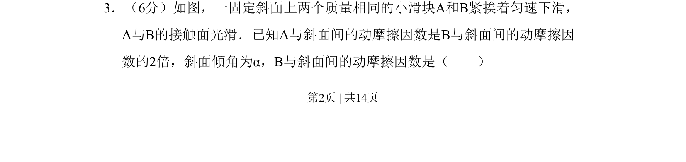

## 题面

## 摘要

该题基于滑块在斜面上的匀速运动平衡状态，求解B滑块与斜面间的动摩擦因数。

## 关联考点

- [[受力分析]]
- [[208-共点力平衡|共点力平衡]]
- [[097-滑动摩擦力|滑动摩擦力]]
- [[动摩擦因数]]

## 答案与解析

> 📄 原 PDF 第 2 页：`素材/真题/吉林/2008-2024·（吉林）物理高考真题/2008年高考物理试卷（全国卷Ⅱ）（解析卷）.pdf`
