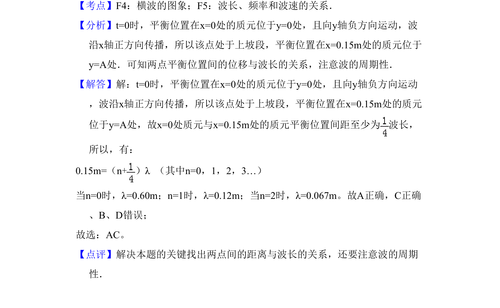

## 题面

## 摘要

根据波传播方向和两质元的振动状态，求解简谐横波的可能波长。

## 关联考点

- [[362-机械波|机械波]]
- [[370-波长|波长]]
- [[478-波的传播|波的传播]]
- [[472-振动状态|振动状态]]

## 答案与解析

> 📄 原 PDF 第 3 页：`素材/真题/吉林/2008-2024·（吉林）物理高考真题/2008年高考物理试卷（全国卷Ⅱ）（解析卷）.pdf`
