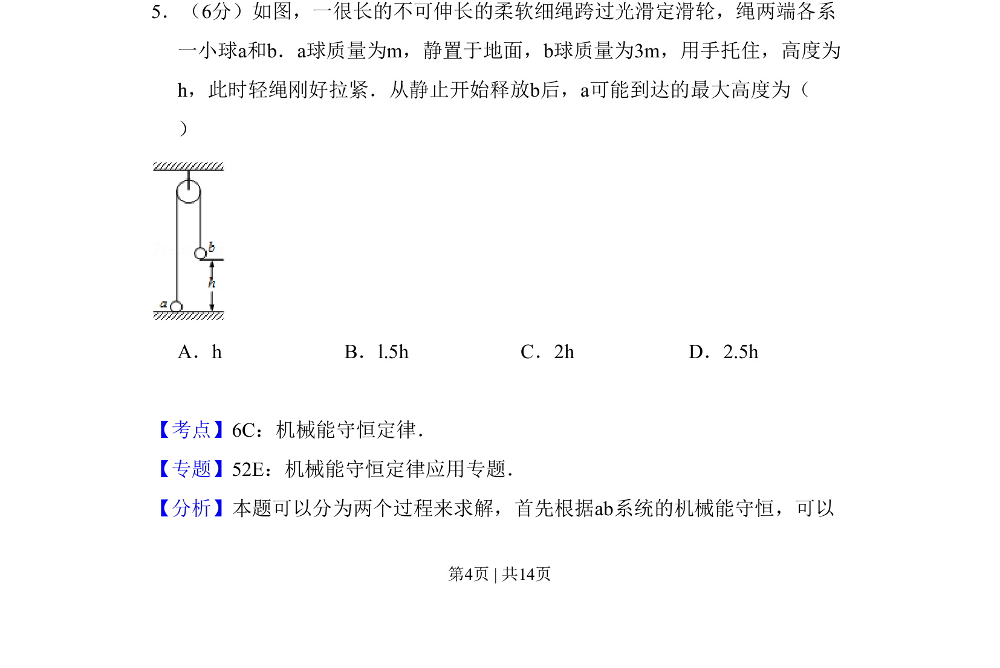
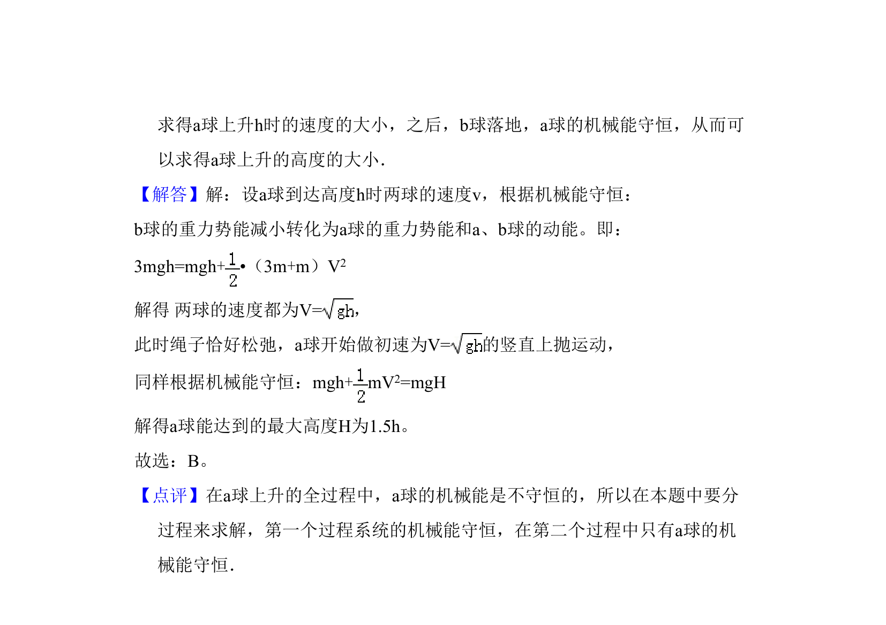

## 题面

## 摘要

一轻绳跨过定滑轮连接两球，b 球释放后通过机械能守恒定律分析 a 球能上升的最大高度。

## 关联考点

- [[085-机械能守恒-初中|机械能守恒定律]]
- [[739-连接体|连接体]]
- [[075-定滑轮|定滑轮]]

## 答案与解析

> 📄 原 PDF 第 4 页：`素材/真题/吉林/2008-2024·（吉林）物理高考真题/2008年高考物理试卷（全国卷Ⅱ）（解析卷）.pdf`
