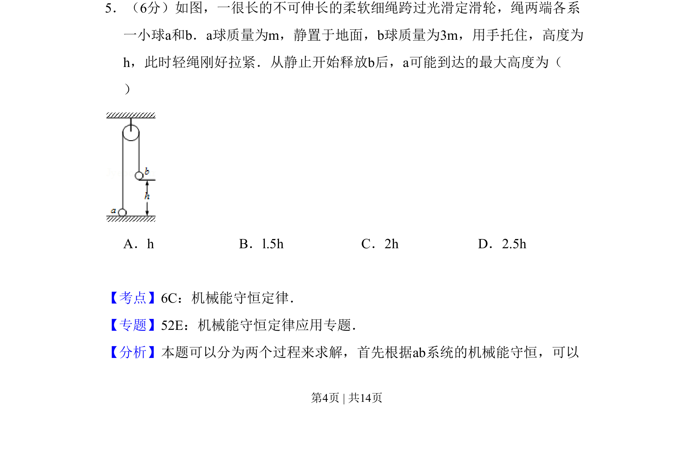
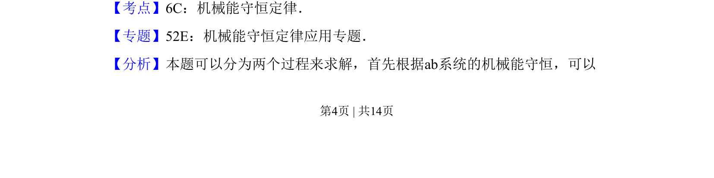
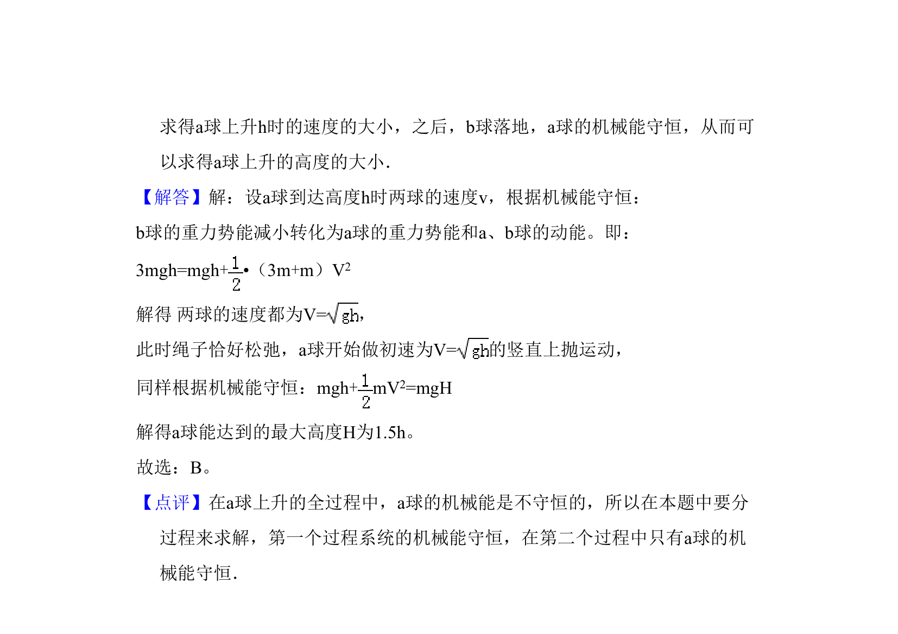

## 题面

## 摘要

一轻绳跨过定滑轮连接两球，b 球释放后通过机械能守恒定律分析 a 球能上升的最大高度。

## 关联考点

- [[085-机械能守恒-初中|机械能守恒定律]]
- [[738-连接体|连接体]]
- [[075-定滑轮|定滑轮]]

## 答案与解析

> 📄 原 PDF 第 4 页：`素材/真题/吉林/2008-2024·（吉林）物理高考真题/2008年高考物理试卷（全国卷Ⅱ）（解析卷）.pdf`

<!-- 题干文本-start -->
## 题干文本
5．（6分）如图，一很长的不可伸长的柔软细绳跨过光滑定滑轮，绳两端各系
一小球a和b．a球质量为m，静置于地面，b球质量为3m，用手托住，高度为
h，此时轻绳刚好拉紧．从静止开始释放b后，a可能到达的最大高度为（　　
）
A．h B．l.5h C．2h D．2.5h
<!-- 题干文本-end -->

<!-- 解析文本-start -->
## 解析文本
【考点】6C：机械能守恒定律．菁优网版权所有
【专题】52E：机械能守恒定律应用专题．
【分析】本题可以分为两个过程来求解，首先根据ab系统的机械能守恒，可以
<!-- 解析文本-end -->
