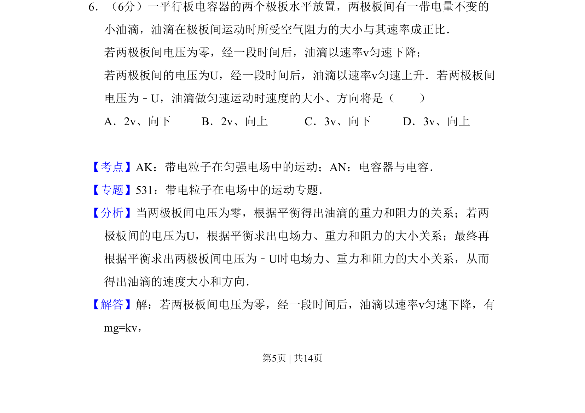
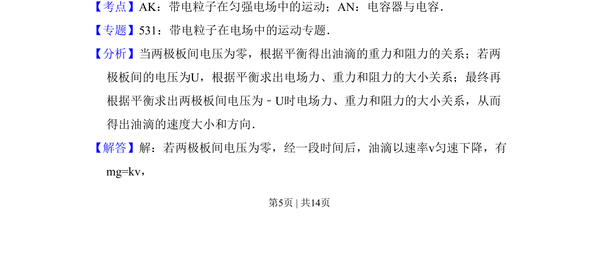
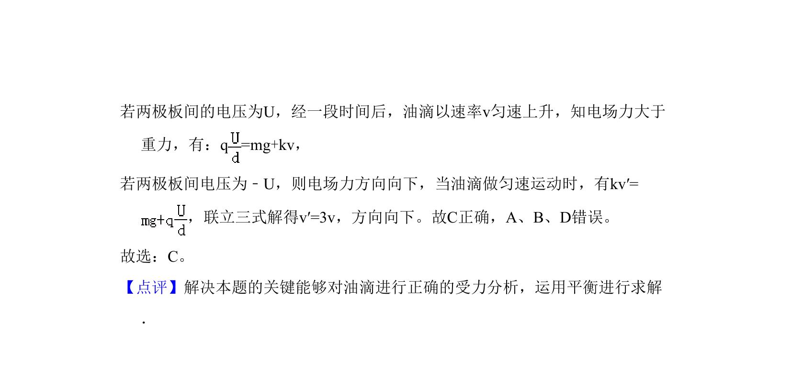

## 题面

## 摘要

油滴在平行板电容器电场、重力与空气阻力作用下多次匀速运动，分析平衡条件求速度。

## 关联考点

- [[468-带电粒子在匀强电场中的运动|带电粒子在匀强电场中的运动]]
- [[604-平衡条件|平衡条件]]
- [[313-电容器|电容器]]
- [[747-阻力与速度成正比|阻力与速度成正比]]

## 答案与解析

> 📄 原 PDF 第 5 页：`素材/真题/吉林/2008-2024·（吉林）物理高考真题/2008年高考物理试卷（全国卷Ⅱ）（解析卷）.pdf`
