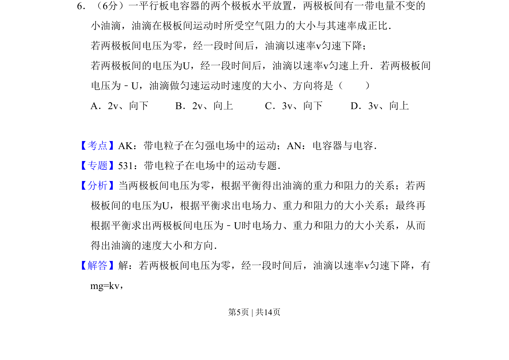
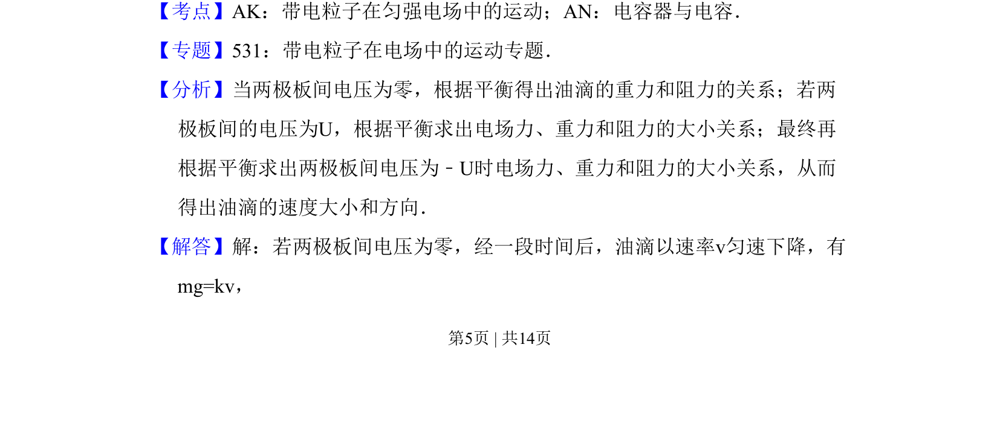
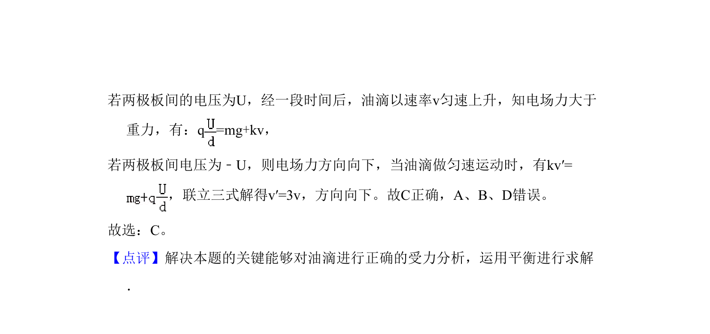

## 题面

## 摘要

油滴在平行板电容器电场、重力与空气阻力作用下多次匀速运动，分析平衡条件求速度。

## 关联考点

- [[468-带电粒子在匀强电场中的运动|带电粒子在匀强电场中的运动]]
- [[604-平衡条件|平衡条件]]
- [[313-电容器|电容器]]
- [[747-阻力与速度成正比|阻力与速度成正比]]

## 答案与解析

> 📄 原 PDF 第 5 页：`素材/真题/吉林/2008-2024·（吉林）物理高考真题/2008年高考物理试卷（全国卷Ⅱ）（解析卷）.pdf`

<!-- 题干文本-start -->
## 题干文本
6．（6分）一平行板电容器的两个极板水平放置，两极板间有一带电量不变的
小油滴，油滴在极板间运动时所受空气阻力的大小与其速率成正比． 
若两极板间电压为零，经一段时间后，油滴以速率v匀速下降； 
若两极板间的电压为U，经一段时间后，油滴以速率v匀速上升．若两极板间
电压为﹣U，油滴做匀速运动时速度的大小、方向将是（　　）
A．2v、向下B．2v、向上C．3v、向下D．3v、向上
<!-- 题干文本-end -->

<!-- 解析文本-start -->
## 解析文本
【考点】AK：带电粒子在匀强电场中的运动；AN：电容器与电容．菁优网版权所有
【专题】531：带电粒子在电场中的运动专题．
【分析】当两极板间电压为零，根据平衡得出油滴的重力和阻力的关系；若两
极板间的电压为U，根据平衡求出电场力、重力和阻力的大小关系；最终再
根据平衡求出两极板间电压为﹣U时电场力、重力和阻力的大小关系，从而
得出油滴的速度大小和方向．
【解答】解：若两极板间电压为零，经一段时间后，油滴以速率v匀速下降，有
mg=kv，
<!-- 解析文本-end -->
