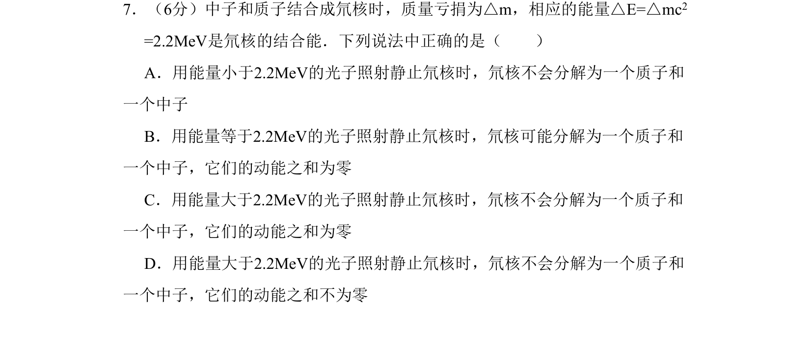
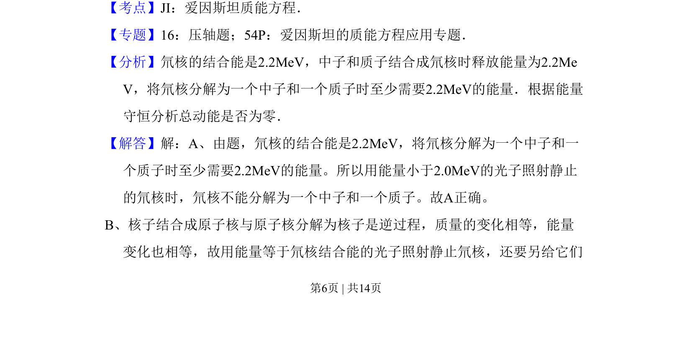
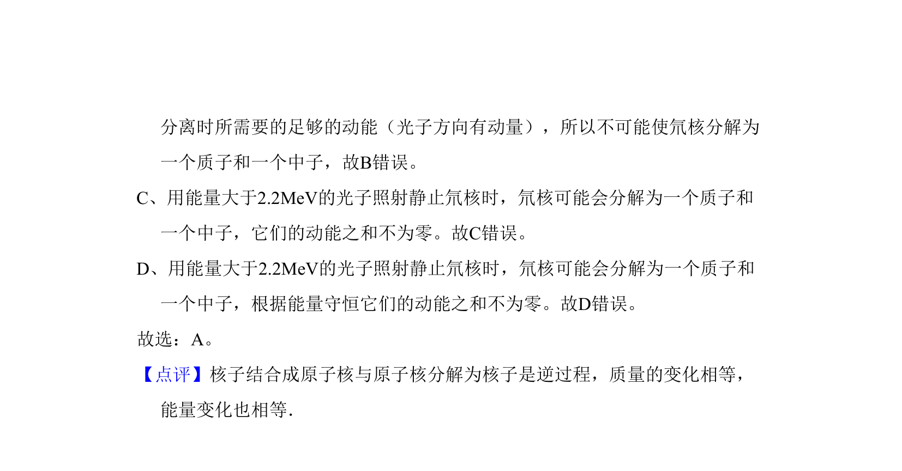

## 题面

## 摘要

氘核结合能及光子能量与核分解条件的判断

## 关联考点

- [[661-爱因斯坦质能方程|爱因斯坦质能方程]]
- [[717-结合能|结合能]]
- [[197-能量守恒定律|能量守恒]]

## 答案与解析

> 📄 原 PDF 第 6 页：`素材/真题/吉林/2008-2024·（吉林）物理高考真题/2008年高考物理试卷（全国卷Ⅱ）（解析卷）.pdf`
