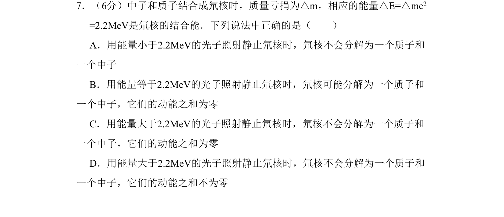
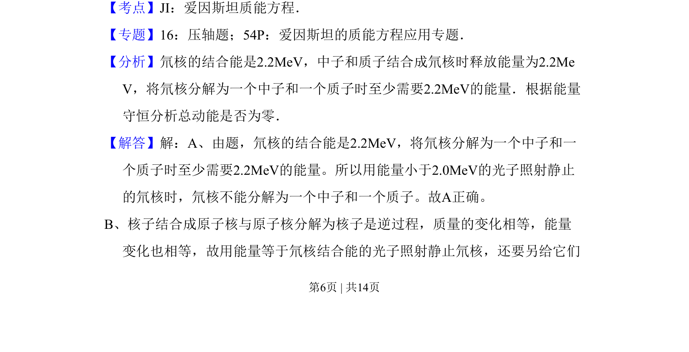
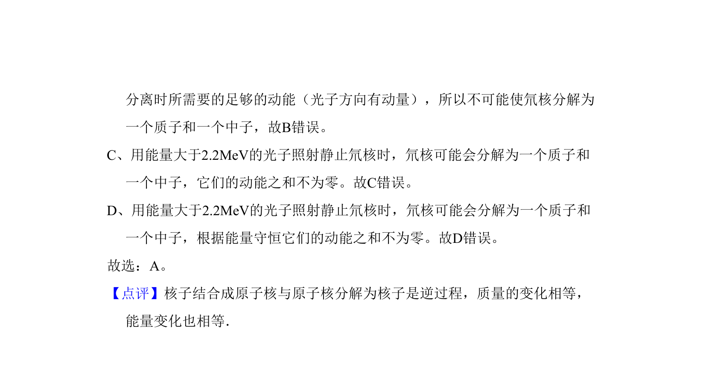

## 题面

## 摘要

氘核结合能及光子能量与核分解条件的判断

## 关联考点

- [[661-爱因斯坦质能方程|爱因斯坦质能方程]]
- [[717-结合能|结合能]]
- [[197-能量守恒定律|能量守恒]]

## 答案与解析

> 📄 原 PDF 第 6 页：`素材/真题/吉林/2008-2024·（吉林）物理高考真题/2008年高考物理试卷（全国卷Ⅱ）（解析卷）.pdf`

<!-- 题干文本-start -->
## 题干文本
7．（6分）中子和质子结合成氘核时，质量亏捐为△m，相应的能量△E=△mc2
=2.2MeV是氘核的结合能．下列说法中正确的是（　　）
A．用能量小于2.2MeV的光子照射静止氘核时，氘核不会分解为一个质子和
一个中子
B．用能量等于2.2MeV的光子照射静止氘核时，氘核可能分解为一个质子和
一个中子，它们的动能之和为零
C．用能量大于2.2MeV的光子照射静止氘核时，氘核不会分解为一个质子和
一个中子，它们的动能之和为零
D．用能量大于2.2MeV的光子照射静止氘核时，氘核不会分解为一个质子和
一个中子，它们的动能之和不为零
<!-- 题干文本-end -->

<!-- 解析文本-start -->
## 解析文本
【考点】JI：爱因斯坦质能方程．菁优网版权所有
【专题】16：压轴题；54P：爱因斯坦的质能方程应用专题．
【分析】氘核的结合能是2.2MeV，中子和质子结合成氘核时释放能量为2.2Me
V，将氘核分解为一个中子和一个质子时至少需要2.2MeV的能量．根据能量
守恒分析总动能是否为零．
【解答】解：A、由题，氘核的结合能是2.2MeV，将氘核分解为一个中子和一
个质子时至少需要2.2MeV的能量。所以用能量小于2.0MeV的光子照射静止
的氘核时，氘核不能分解为一个中子和一个质子。故A正确。
B、核子结合成原子核与原子核分解为核子是逆过程，质量的变化相等，能量
变化也相等，故用能量等于氘核结合能的光子照射静止氘核，还要另给它们
<!-- 解析文本-end -->
