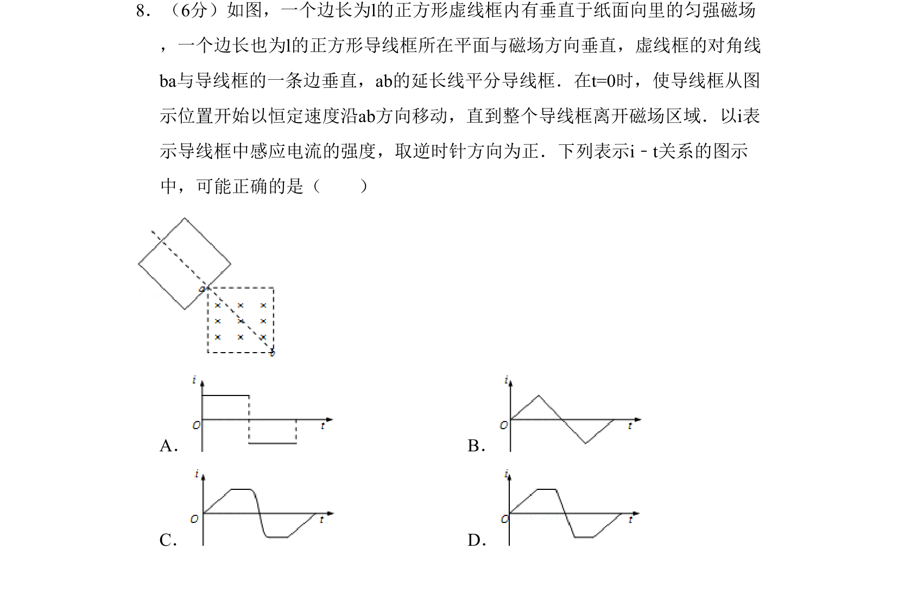
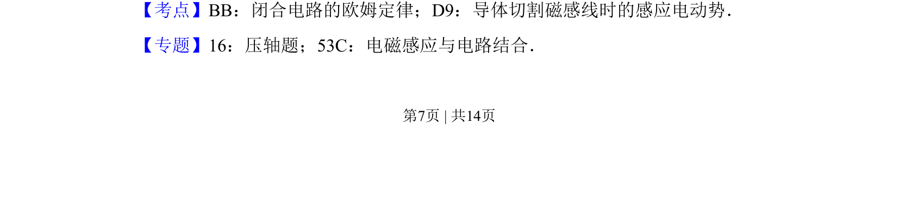
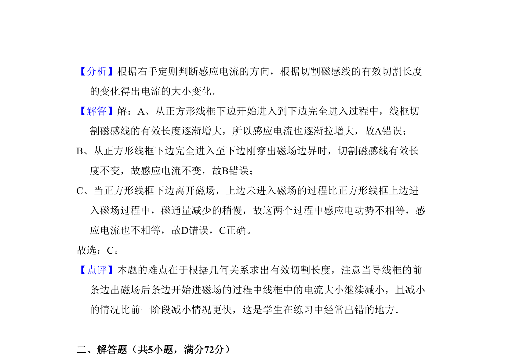

## 题面

## 摘要

导线框在匀强磁场中匀速移动，分析切割磁感线产生的感应电流随时间变化规律。

## 关联考点

- [[332-闭合电路欧姆定律|闭合电路欧姆定律]]
- [[589-导体切割磁感线|导体切割磁感线]]
- [[175-电磁感应|电磁感应]]
- [[693-电路分析|电路分析]]

## 答案与解析

> 📄 原 PDF 第 7 页：`素材/真题/吉林/2008-2024·（吉林）物理高考真题/2008年高考物理试卷（全国卷Ⅱ）（解析卷）.pdf`
