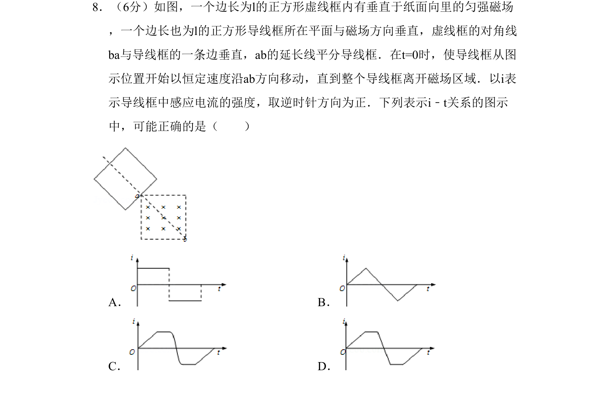
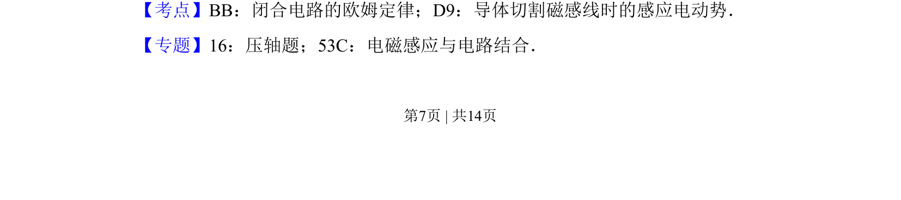
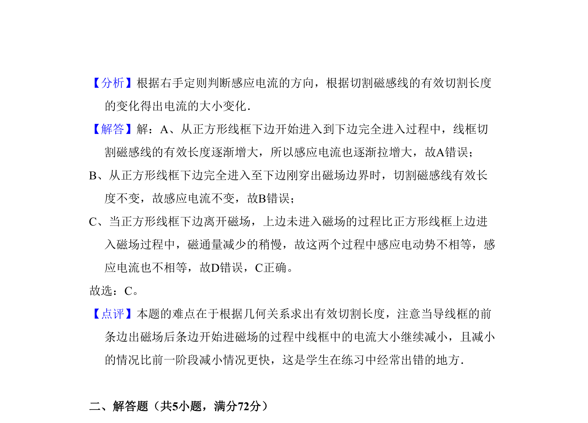

## 题面

## 摘要

导线框在匀强磁场中匀速移动，分析切割磁感线产生的感应电流随时间变化规律。

## 关联考点

- [[332-闭合电路欧姆定律|闭合电路欧姆定律]]
- [[589-导体切割磁感线|导体切割磁感线]]
- [[175-电磁感应|电磁感应]]
- [[693-电路分析|电路分析]]

## 答案与解析

> 📄 原 PDF 第 7 页：`素材/真题/吉林/2008-2024·（吉林）物理高考真题/2008年高考物理试卷（全国卷Ⅱ）（解析卷）.pdf`

<!-- 题干文本-start -->
## 题干文本
8．（6分）如图，一个边长为l的正方形虚线框内有垂直于纸面向里的匀强磁场
，一个边长也为l的正方形导线框所在平面与磁场方向垂直，虚线框的对角线
ba与导线框的一条边垂直，ab的延长线平分导线框．在t=0时，使导线框从图
示位置开始以恒定速度沿ab方向移动，直到整个导线框离开磁场区域．以i表
示导线框中感应电流的强度，取逆时针方向为正．下列表示i﹣t关系的图示
中，可能正确的是（　　）
A．B．
C．D．
<!-- 题干文本-end -->

<!-- 解析文本-start -->
## 解析文本
【考点】BB：闭合电路的欧姆定律；D9：导体切割磁感线时的感应电动势．菁优网版权所有
【专题】16：压轴题；53C：电磁感应与电路结合．
<!-- 解析文本-end -->
