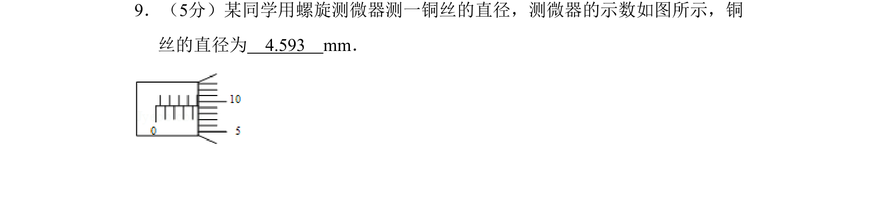
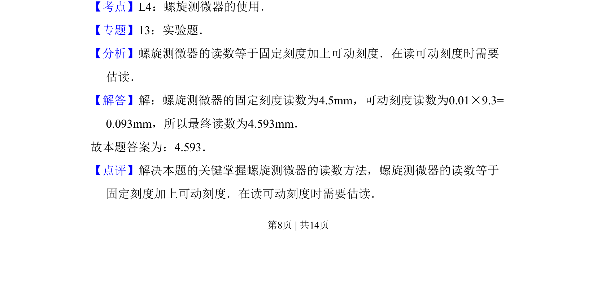

## 题面

## 摘要

考查螺旋测微器的读数方法，包括固定刻度与可动刻度的读取及估读。

## 关联考点

- [[722-螺旋测微器使用|螺旋测微器使用]]
- [[726-读数方法|读数方法]]
- [[580-实验操作|实验操作]]

## 答案与解析

> 📄 原 PDF 第 8 页：`素材/真题/吉林/2008-2024·（吉林）物理高考真题/2008年高考物理试卷（全国卷Ⅱ）（解析卷）.pdf`
