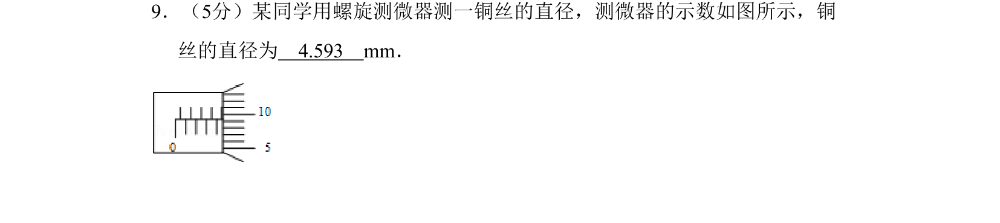
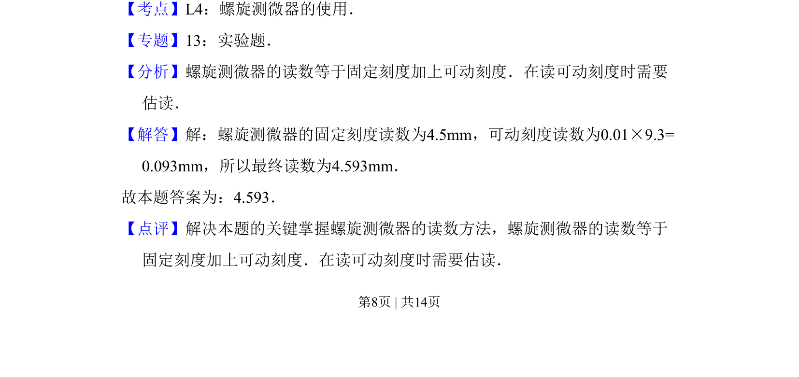

## 题面

## 摘要

考查螺旋测微器的读数方法，包括固定刻度与可动刻度的读取及估读。

## 关联考点

- [[721-螺旋测微器使用|螺旋测微器使用]]
- [[725-读数方法|读数方法]]
- [[580-实验操作|实验操作]]

## 答案与解析

> 📄 原 PDF 第 8 页：`素材/真题/吉林/2008-2024·（吉林）物理高考真题/2008年高考物理试卷（全国卷Ⅱ）（解析卷）.pdf`

<!-- 题干文本-start -->
## 题干文本
9．（5分）某同学用螺旋测微器测一铜丝的直径，测微器的示数如图所示，铜
丝的直径为　4.593　mm．
<!-- 题干文本-end -->

<!-- 解析文本-start -->
## 解析文本
【考点】L4：螺旋测微器的使用．菁优网版权所有
【专题】13：实验题．
【分析】螺旋测微器的读数等于固定刻度加上可动刻度．在读可动刻度时需要
估读．
【解答】解：螺旋测微器的固定刻度读数为4.5mm，可动刻度读数为0.01×9.3=
0.093mm，所以最终读数为4.593mm．
故本题答案为：4.593．
【点评】解决本题的关键掌握螺旋测微器的读数方法，螺旋测微器的读数等于
固定刻度加上可动刻度．在读可动刻度时需要估读．
<!-- 解析文本-end -->
