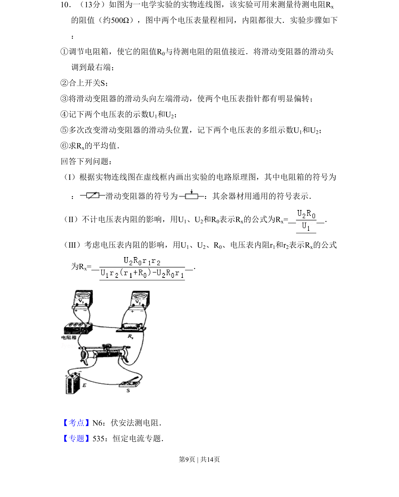

## 题面

## 摘要

该题考查电学实验测量电阻，要求画电路原理图并推导含电压表内阻影响的电阻计算公式

## 关联考点

- [[伏安法测电阻]]
- [[电路原理图]]
- [[141-欧姆定律-初中|欧姆定律]]
- [[误差分析]]

## 答案与解析

> 📄 原 PDF 第 9 页：`素材/真题/吉林/2008-2024·（吉林）物理高考真题/2008年高考物理试卷（全国卷Ⅱ）（解析卷）.pdf`
