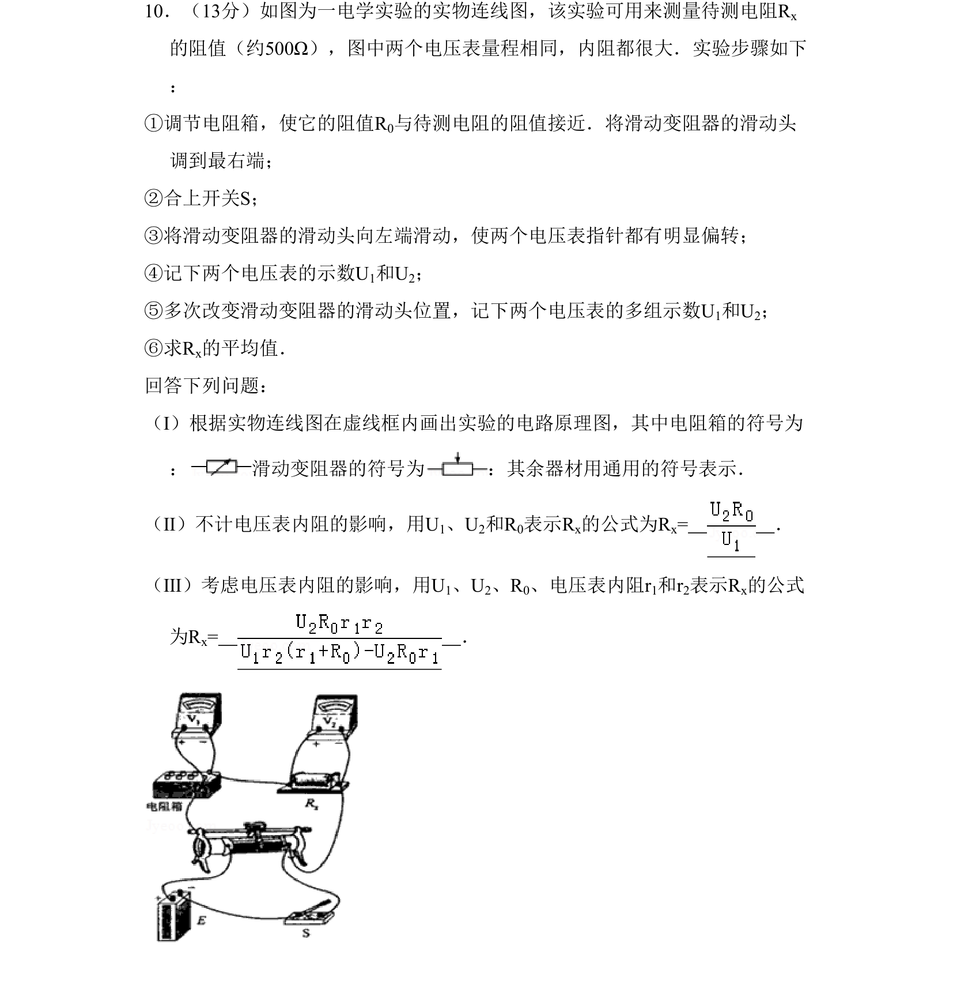
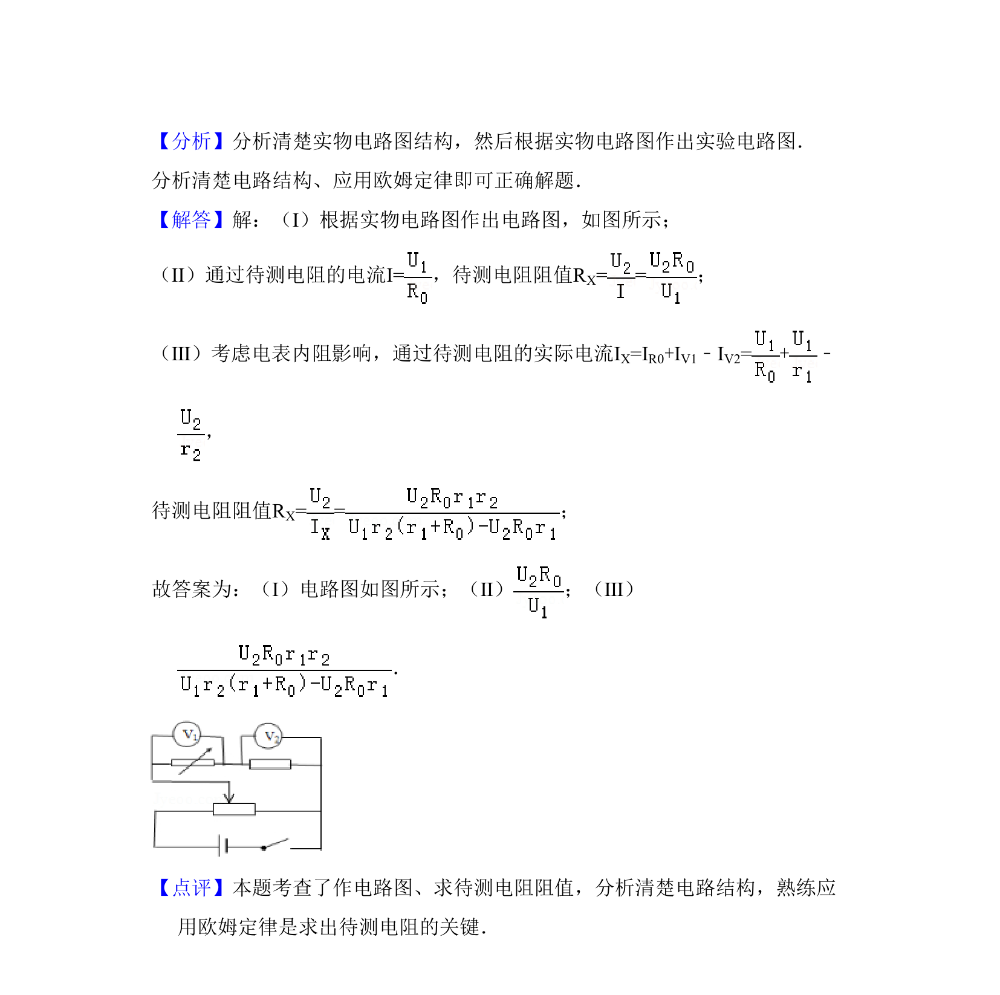

## 题面

## 摘要

该题考查电学实验测量电阻，要求画电路原理图并推导含电压表内阻影响的电阻计算公式

## 关联考点

- [[511-伏安法测电阻|伏安法测电阻]]
- [[694-电路原理图|电路原理图]]
- [[141-欧姆定律-初中|欧姆定律]]
- [[724-误差分析|误差分析]]

## 答案与解析

> 📄 原 PDF 第 9 页：`素材/真题/吉林/2008-2024·（吉林）物理高考真题/2008年高考物理试卷（全国卷Ⅱ）（解析卷）.pdf`

<!-- 题干文本-start -->
## 题干文本
10．（13分）如图为一电学实验的实物连线图，该实验可用来测量待测电阻Rx
的阻值（约500Ω），图中两个电压表量程相同，内阻都很大．实验步骤如下
：
①调节电阻箱，使它的阻值R0与待测电阻的阻值接近．将滑动变阻器的滑动头
调到最右端；
②合上开关S；
③将滑动变阻器的滑动头向左端滑动，使两个电压表指针都有明显偏转；
④记下两个电压表的示数U1和U2；
⑤多次改变滑动变阻器的滑动头位置，记下两个电压表的多组示数U1和U2；
⑥求Rx的平均值．
回答下列问题：
（Ⅰ）根据实物连线图在虚线框内画出实验的电路原理图，其中电阻箱的符号为
： 滑动变阻器的符号为 ：其余器材用通用的符号表示．
（Ⅱ）不计电压表内阻的影响，用U1、U2和R0表示Rx的公式为Rx=　 　．
（Ⅲ）考虑电压表内阻的影响，用U1、U2、R0、电压表内阻r1和r2表示Rx的公式
为Rx=　 　．
<!-- 题干文本-end -->

<!-- 解析文本-start -->
## 解析文本
【考点】N6：伏安法测电阻．菁优网版权所有
【专题】535：恒定电流专题．
<!-- 解析文本-end -->
