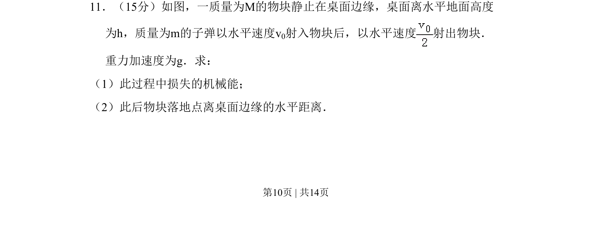
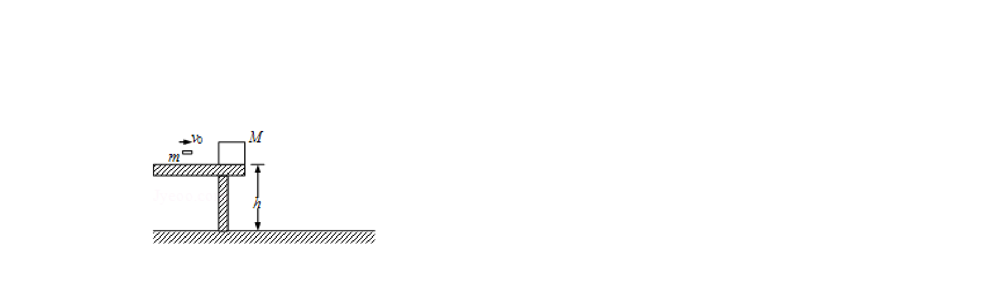
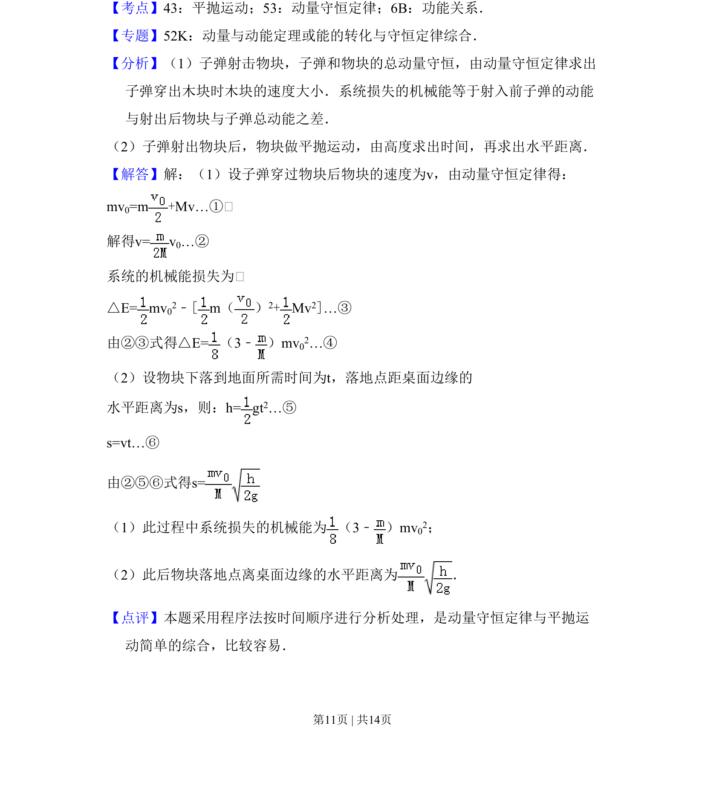

## 题面

## 摘要

该题为物理题，考查子弹击中物块过程中的动量守恒、能量损失以及物块平抛运动的水平位移。

## 关联考点

- [[539-动量守恒|动量守恒]]
- [[721-能量转化|能量转化]]
- [[261-平抛运动|平抛运动]]

## 答案与解析

> 📄 原 PDF 第 10 页：`素材/真题/吉林/2008-2024·（吉林）物理高考真题/2008年高考物理试卷（全国卷Ⅱ）（解析卷）.pdf`
