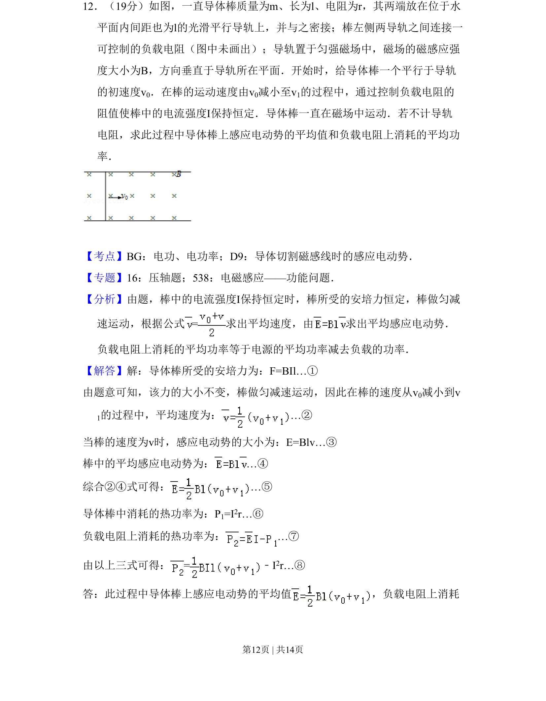
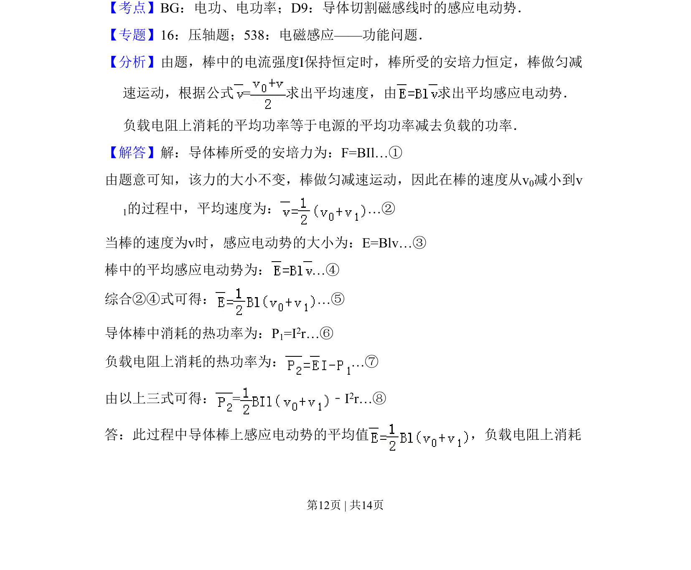
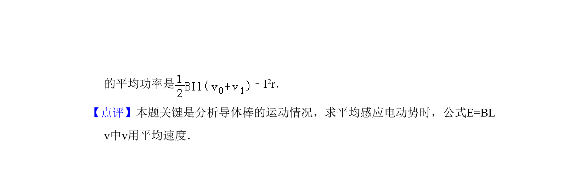

## 题面

## 摘要

导体棒在磁场中做匀减速运动，计算平均感应电动势及负载电阻消耗的平均功率。

## 关联考点

- [[导体切割磁感线时的感应电动势]]
- [[电功电功率]]
- [[023-平均速度|平均速度]]
- [[188-磁场对通电导体的作用|安培力]]

## 答案与解析

> 📄 原 PDF 第 12 页：`素材/真题/吉林/2008-2024·（吉林）物理高考真题/2008年高考物理试卷（全国卷Ⅱ）（解析卷）.pdf`
