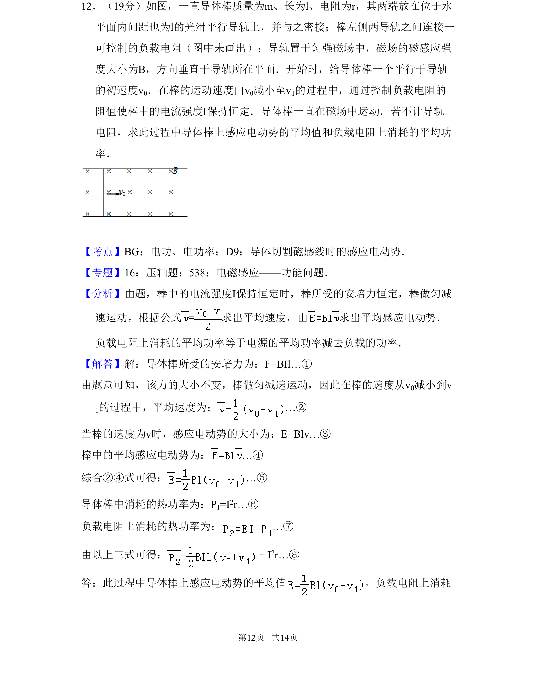
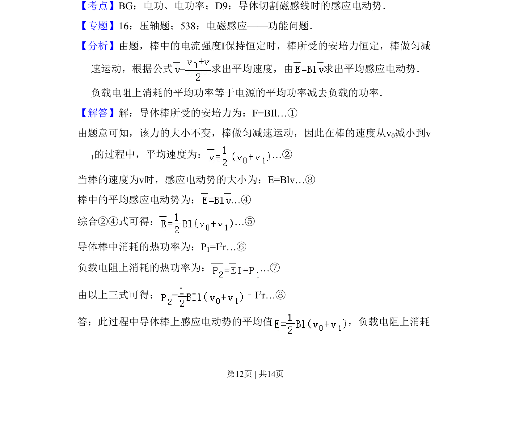
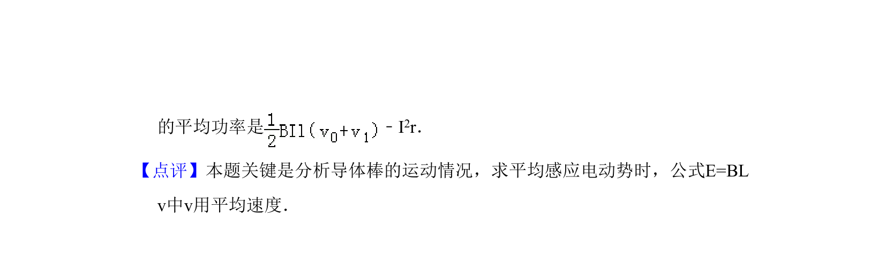

## 题面

## 摘要

导体棒在磁场中做匀减速运动，计算平均感应电动势及负载电阻消耗的平均功率。

## 关联考点

- [[590-导体切割磁感线时的感应电动势|导体切割磁感线时的感应电动势]]
- [[484-电功电功率|电功电功率]]
- [[023-平均速度|平均速度]]
- [[188-磁场对通电导体的作用|安培力]]

## 答案与解析

> 📄 原 PDF 第 12 页：`素材/真题/吉林/2008-2024·（吉林）物理高考真题/2008年高考物理试卷（全国卷Ⅱ）（解析卷）.pdf`

<!-- 题干文本-start -->
## 题干文本
12．（19分）如图，一直导体棒质量为m、长为l、电阻为r，其两端放在位于水
平面内间距也为l的光滑平行导轨上，并与之密接；棒左侧两导轨之间连接一
可控制的负载电阻（图中未画出）；导轨置于匀强磁场中，磁场的磁感应强
度大小为B，方向垂直于导轨所在平面．开始时，给导体棒一个平行于导轨
的初速度v0．在棒的运动速度由v0减小至v1的过程中，通过控制负载电阻的
阻值使棒中的电流强度I保持恒定．导体棒一直在磁场中运动．若不计导轨
电阻，求此过程中导体棒上感应电动势的平均值和负载电阻上消耗的平均功
率．
<!-- 题干文本-end -->

<!-- 解析文本-start -->
## 解析文本
【考点】BG：电功、电功率；D9：导体切割磁感线时的感应电动势．菁优网版权所有
【专题】16：压轴题；538：电磁感应——功能问题．
【分析】由题，棒中的电流强度I保持恒定时，棒所受的安培力恒定，棒做匀减
速运动，根据公式=求出平均速度，由 求出平均感应电动势．
负载电阻上消耗的平均功率等于电源的平均功率减去负载的功率．
【解答】解：导体棒所受的安培力为：F=BIl…①
由题意可知，该力的大小不变，棒做匀减速运动，因此在棒的速度从v0减小到v
1的过程中，平均速度为：…②
当棒的速度为v时，感应电动势的大小为：E=Blv…③
棒中的平均感应电动势为：…④
综合②④式可得：…⑤
导体棒中消耗的热功率为：P1=I2r…⑥
负载电阻上消耗的热功率为：…⑦
由以上三式可得：=﹣I 2r…⑧
答：此过程中导体棒上感应电动势的平均值 ，负载电阻上消耗
<!-- 解析文本-end -->
