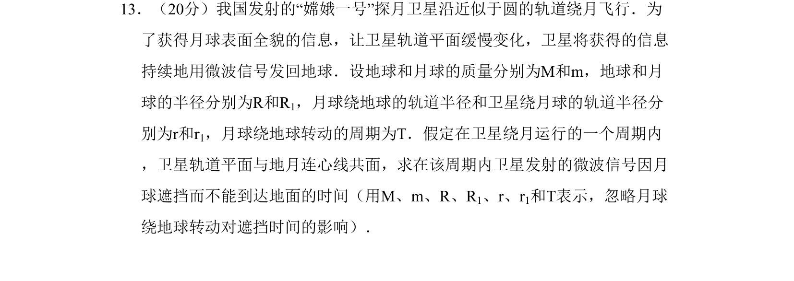
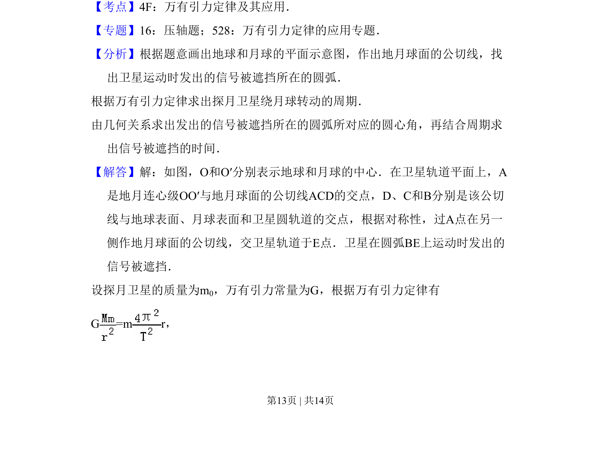
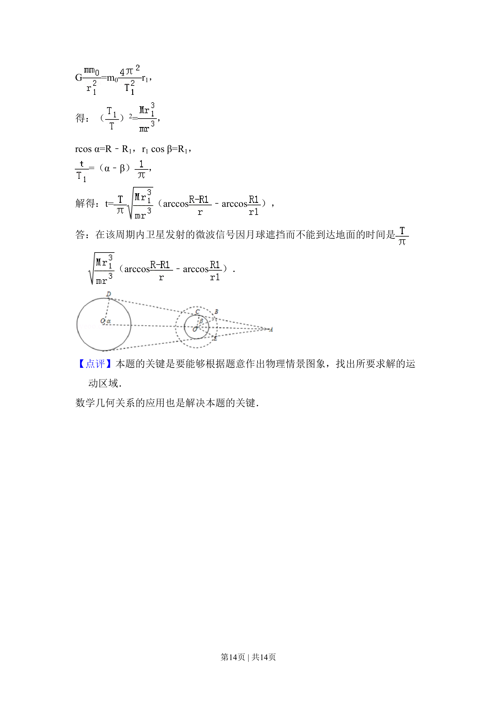

## 题面

## 摘要

本题通过万有引力定律和几何关系求解卫星信号被月球遮挡的时间，涉及圆周运动与空间遮挡模型。

## 关联考点

- [[246-万有引力定律|万有引力定律]]
- [[258-圆周运动|圆周运动]]
- [[456-几何关系|几何关系]]

## 答案与解析

> 📄 原 PDF 第 13 页：`素材/真题/吉林/2008-2024·（吉林）物理高考真题/2008年高考物理试卷（全国卷Ⅱ）（解析卷）.pdf`
