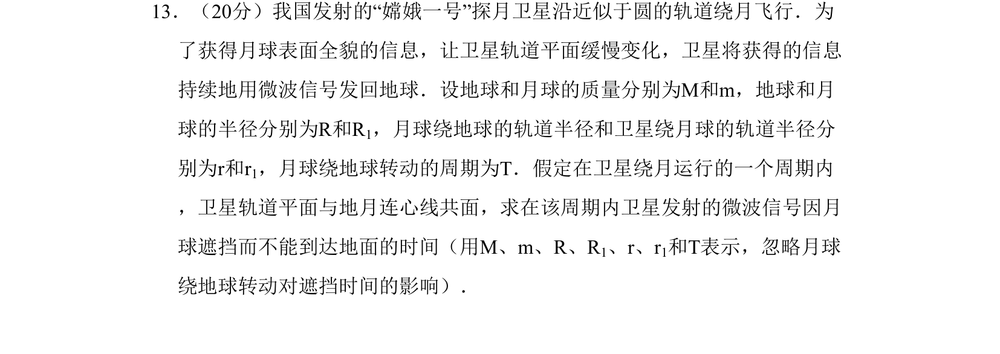
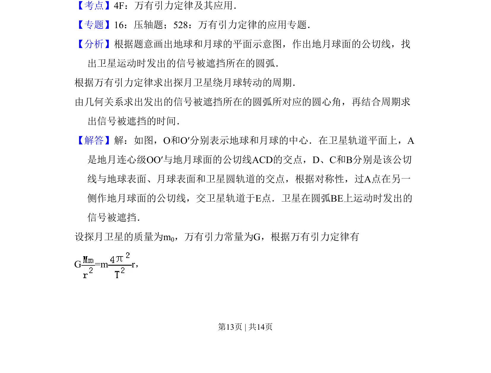
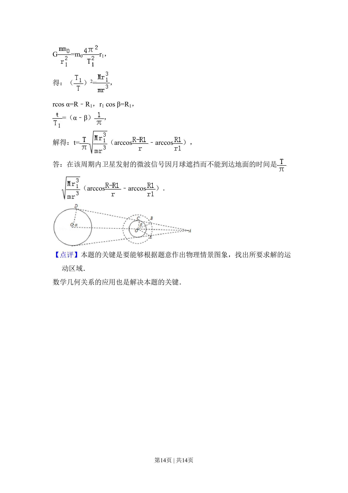

## 题面

## 摘要

本题通过万有引力定律和几何关系求解卫星信号被月球遮挡的时间，涉及圆周运动与空间遮挡模型。

## 关联考点

- [[246-万有引力定律|万有引力定律]]
- [[258-圆周运动|圆周运动]]
- [[456-几何关系|几何关系]]

## 答案与解析

> 📄 原 PDF 第 13 页：`素材/真题/吉林/2008-2024·（吉林）物理高考真题/2008年高考物理试卷（全国卷Ⅱ）（解析卷）.pdf`

<!-- 题干文本-start -->
## 题干文本
13．（20分）我国发射的“嫦娥一号”探月卫星沿近似于圆的轨道绕月飞行．为
了获得月球表面全貌的信息，让卫星轨道平面缓慢变化，卫星将获得的信息
持续地用微波信号发回地球．设地球和月球的质量分别为M和m，地球和月
球的半径分别为R和R1，月球绕地球的轨道半径和卫星绕月球的轨道半径分
别为r和r1，月球绕地球转动的周期为T．假定在卫星绕月运行的一个周期内
，卫星轨道平面与地月连心线共面，求在该周期内卫星发射的微波信号因月
球遮挡而不能到达地面的时间（用M、m、R、R1、r、r1和T表示，忽略月球
绕地球转动对遮挡时间的影响）．
<!-- 题干文本-end -->

<!-- 解析文本-start -->
## 解析文本
【考点】4F：万有引力定律及其应用．菁优网版权所有
【专题】16：压轴题；528：万有引力定律的应用专题．
【分析】根据题意画出地球和月球的平面示意图，作出地月球面的公切线，找
出卫星运动时发出的信号被遮挡所在的圆弧．
根据万有引力定律求出探月卫星绕月球转动的周期．
由几何关系求出发出的信号被遮挡所在的圆弧所对应的圆心角，再结合周期求
出信号被遮挡的时间．
【解答】解：如图，O和O′分别表示地球和月球的中心．在卫星轨道平面上，A
是地月连心级OO′与地月球面的公切线ACD的交点，D、C和B分别是该公切
线与地球表面、月球表面和卫星圆轨道的交点，根据对称性，过A点在另一
侧作地月球面的公切线，交卫星轨道于E点．卫星在圆弧BE上运动时发出的
信号被遮挡．
设探月卫星的质量为m0，万有引力常量为G，根据万有引力定律有
G =m r，
<!-- 解析文本-end -->
