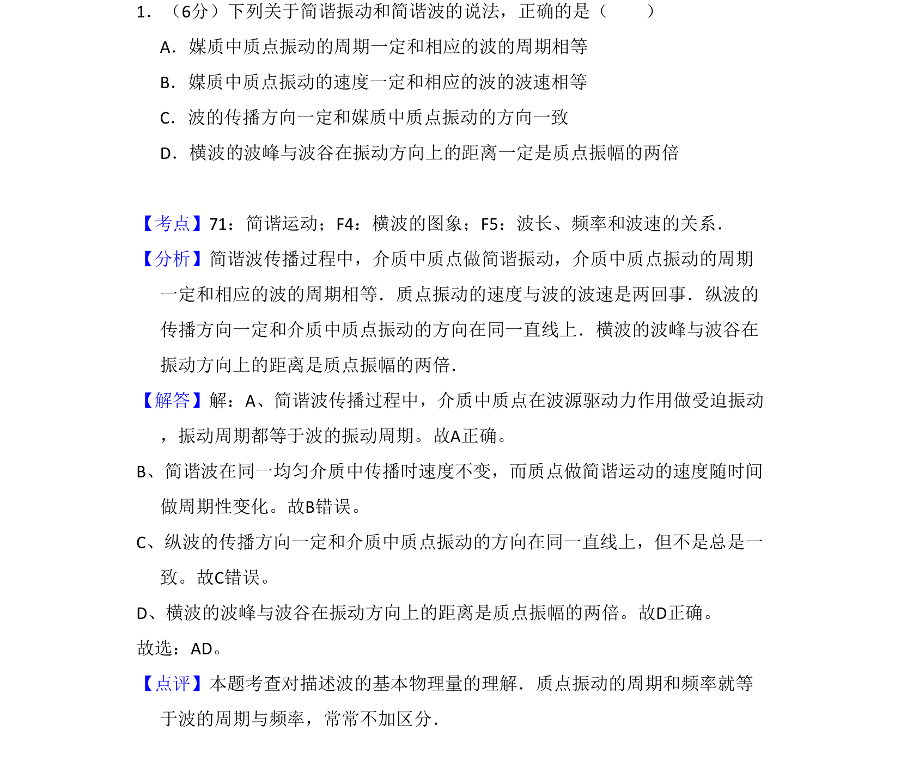

## 题面

## 摘要

简谐振动与简谐波中周期、波速、传播方向及振幅关系的概念辨析

## 关联考点

- [[373-简谐运动|简谐运动]]
- [[横波的图象]]
- [[370-波长|波长]]
- [[频率和波速的关系]]

## 答案与解析

> 📄 原 PDF 第 1 页：`素材/真题/吉林/2008-2024·（吉林）物理高考真题/2009年高考物理试卷（全国卷Ⅱ）（解析卷）.pdf`
