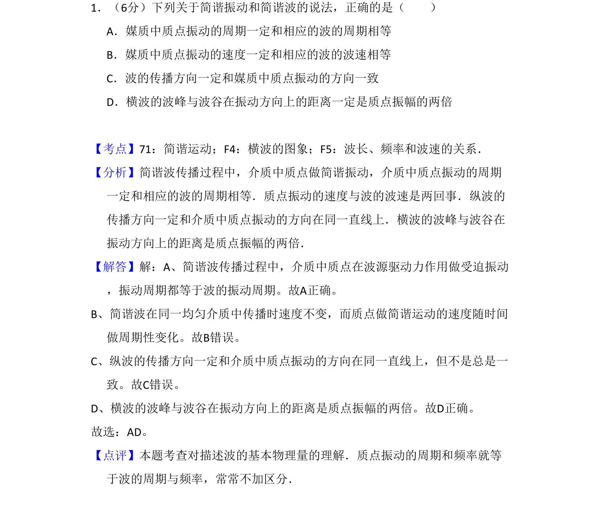
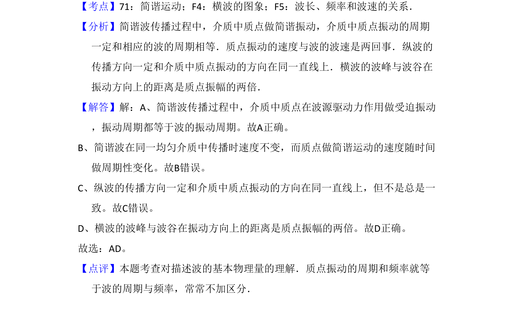

## 题面

## 摘要

简谐振动与简谐波中周期、波速、传播方向及振幅关系的概念辨析

## 关联考点

- [[373-简谐运动|简谐运动]]
- [[630-横波的图象|横波的图象]]
- [[370-波长|波长]]
- [[749-频率和波速的关系|频率和波速的关系]]

## 答案与解析

> 📄 原 PDF 第 1 页：`素材/真题/吉林/2008-2024·（吉林）物理高考真题/2009年高考物理试卷（全国卷Ⅱ）（解析卷）.pdf`

<!-- 题干文本-start -->
## 题干文本
1．（6分）下列关于简谐振动和简谐波的说法，正确的是（　　）
A．媒质中质点振动的周期一定和相应的波的周期相等
B．媒质中质点振动的速度一定和相应的波的波速相等
C．波的传播方向一定和媒质中质点振动的方向一致
D．横波的波峰与波谷在振动方向上的距离一定是质点振幅的两倍
<!-- 题干文本-end -->

<!-- 解析文本-start -->
## 解析文本
【考点】71：简谐运动；F4：横波的图象；F5：波长、频率和波速的关系．菁优网版权所有
【分析】简谐波传播过程中，介质中质点做简谐振动，介质中质点振动的周期
一定和相应的波的周期相等．质点振动的速度与波的波速是两回事．纵波的
传播方向一定和介质中质点振动的方向在同一直线上．横波的波峰与波谷在
振动方向上的距离是质点振幅的两倍．
【解答】解：A、简谐波传播过程中，介质中质点在波源驱动力作用做受迫振动
，振动周期都等于波的振动周期。故A正确。
B、简谐波在同一均匀介质中传播时速度不变，而质点做简谐运动的速度随时间
做周期性变化。故B错误。
C、纵波的传播方向一定和介质中质点振动的方向在同一直线上，但不是总是一
致。故C错误。
D、横波的波峰与波谷在振动方向上的距离是质点振幅的两倍。故D正确。
故选：AD。
【点评】本题考查对描述波的基本物理量的理解．质点振动的周期和频率就等
于波的周期与频率，常常不加区分．
<!-- 解析文本-end -->
