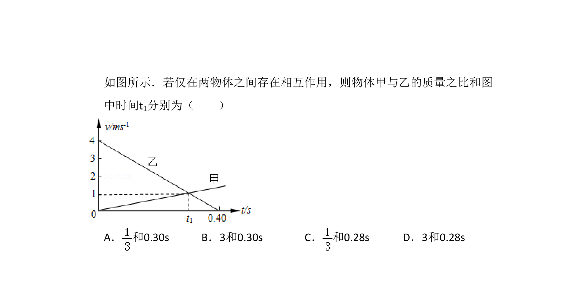
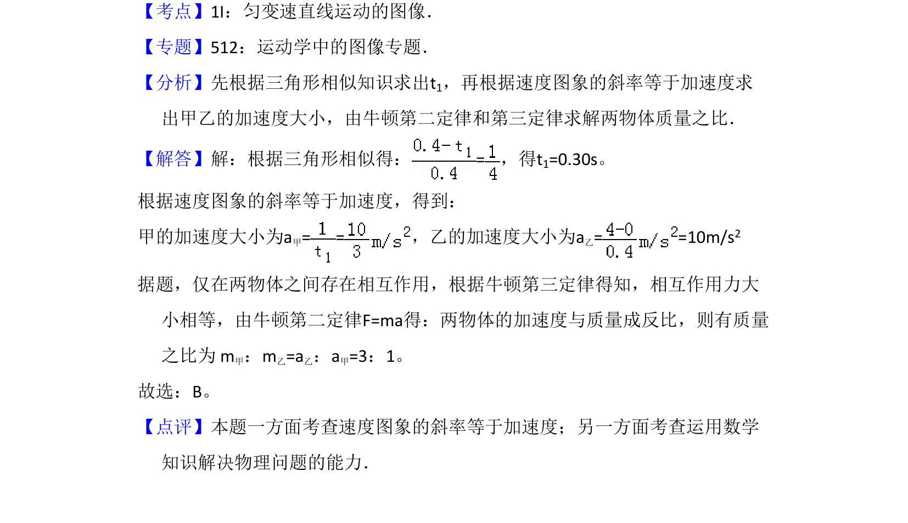

## 题面

## 摘要

两物体v-t图象的分析，考查图象斜率、面积及交点的物理意义。

## 关联考点

- [[498-v-t图象|v-t图象]]
- [[215-匀变速直线运动|匀变速直线运动]]
- [[739-追及相遇|追及相遇]]

## 答案与解析

> 📄 原 PDF 第 1 页：`素材/真题/吉林/2008-2024·（吉林）物理高考真题/2009年高考物理试卷（全国卷Ⅱ）（解析卷）.pdf`
