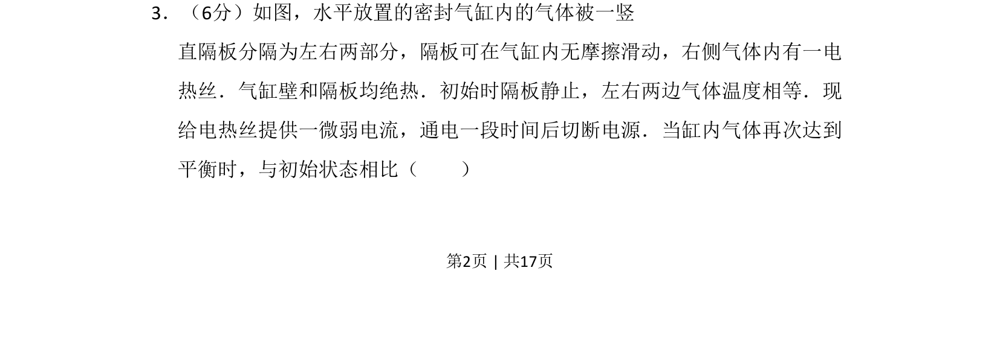
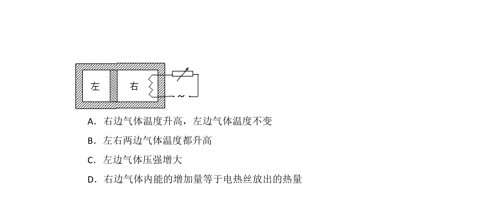
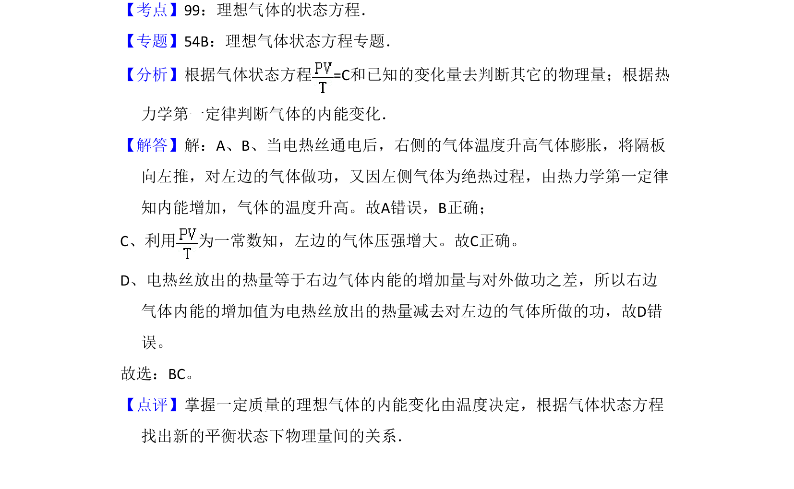

## 题面

## 摘要

该题考查绝热气缸中气体加热后重新平衡时状态参量的变化，涉及热力学第一定律和理想气体状态方程。

## 关联考点

- [[440-热力学第一定律|热力学第一定律]]
- [[446-理想气体状态方程|理想气体状态方程]]
- [[069-压强|压强]]
- [[066-体积|体积]]

## 答案与解析

> 📄 原 PDF 第 2 页：`素材/真题/吉林/2008-2024·（吉林）物理高考真题/2009年高考物理试卷（全国卷Ⅱ）（解析卷）.pdf`
