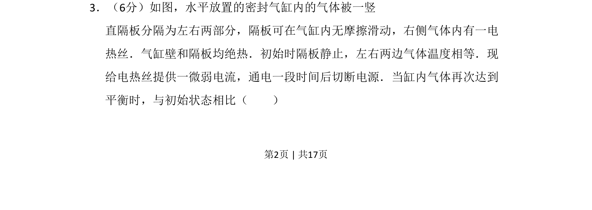
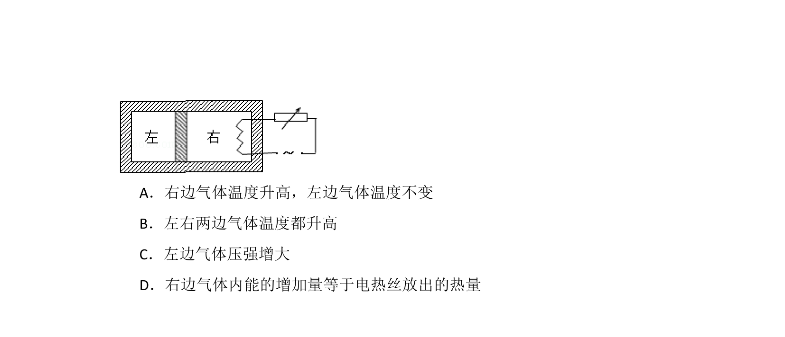
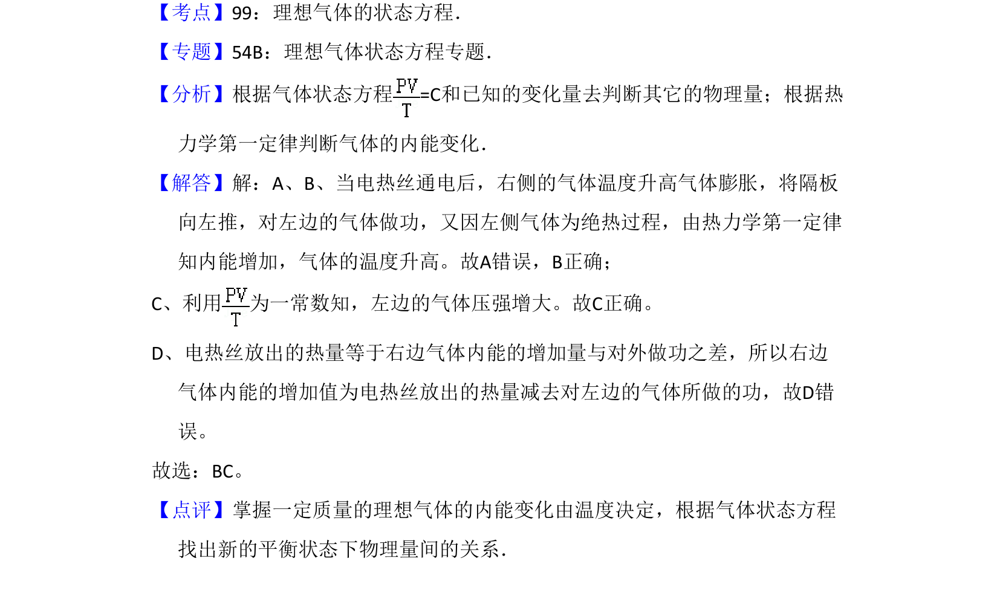

## 题面

## 摘要

该题考查绝热气缸中气体加热后重新平衡时状态参量的变化，涉及热力学第一定律和理想气体状态方程。

## 关联考点

- [[440-热力学第一定律|热力学第一定律]]
- [[446-理想气体状态方程|理想气体状态方程]]
- [[069-压强|压强]]
- [[066-体积|体积]]

## 答案与解析

> 📄 原 PDF 第 2 页：`素材/真题/吉林/2008-2024·（吉林）物理高考真题/2009年高考物理试卷（全国卷Ⅱ）（解析卷）.pdf`

<!-- 题干文本-start -->
## 题干文本
3．（6分）如图，水平放置的密封气缸内的气体被一竖 
直隔板分隔为左右两部分，隔板可在气缸内无摩擦滑动，右侧气体内有一电
热丝．气缸壁和隔板均绝热．初始时隔板静止，左右两边气体温度相等．现
给电热丝提供一微弱电流，通电一段时间后切断电源．当缸内气体再次达到
平衡时，与初始状态相比（　　）
<!-- 题干文本-end -->

<!-- 解析文本-start -->
## 解析文本

<!-- 解析文本-end -->
