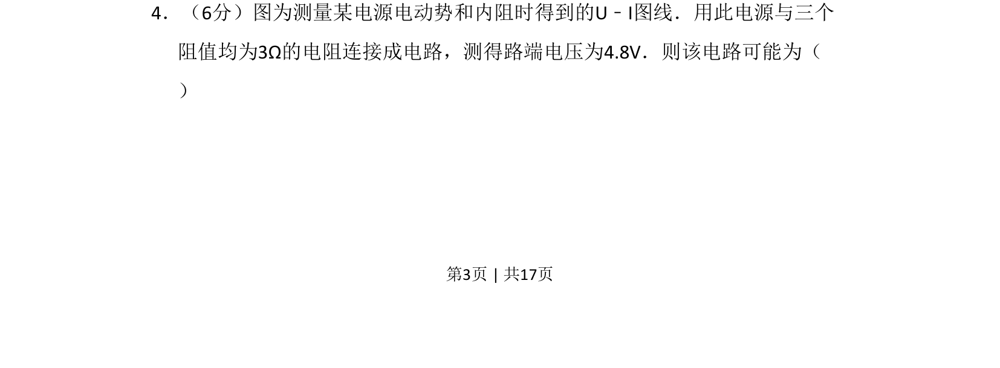
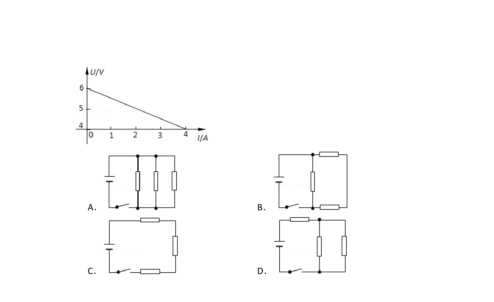
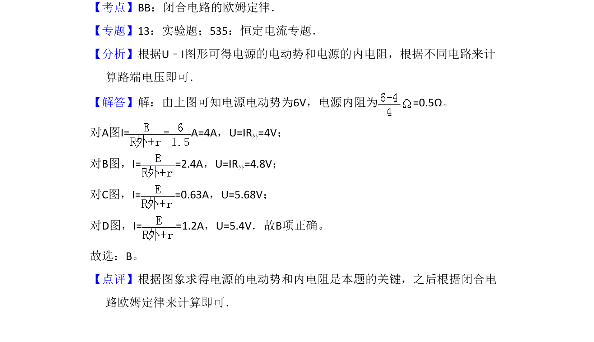

## 题面

## 摘要

根据电源U-I图线求出电动势和内阻，再结合闭合电路欧姆定律判断外电路电阻连接方式。

## 关联考点

- [[332-闭合电路欧姆定律|闭合电路欧姆定律]]
- [[685-电源U-I图像|电源U-I图像]]
- [[451-串并联电路电阻计算|串并联电路电阻计算]]

## 答案与解析

> 📄 原 PDF 第 3 页：`素材/真题/吉林/2008-2024·（吉林）物理高考真题/2009年高考物理试卷（全国卷Ⅱ）（解析卷）.pdf`
