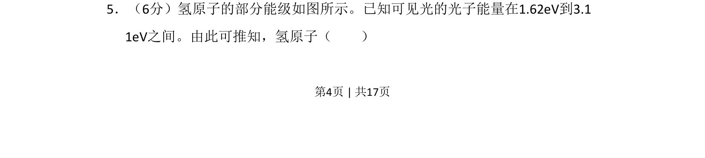
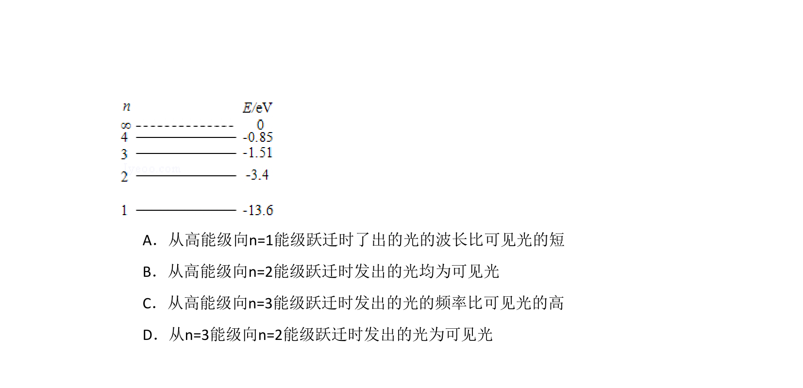
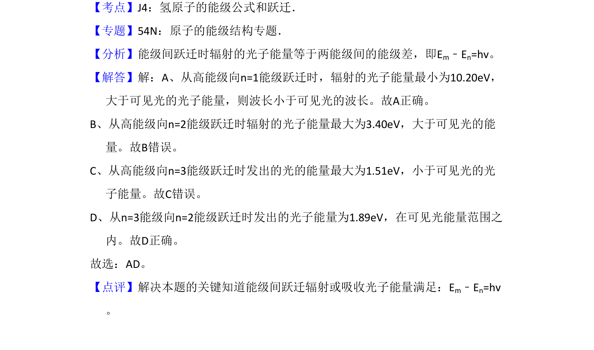

## 题面

## 摘要

该题考查氢原子能级跃迁时辐射光子能量与可见光范围的对应关系，需结合能级差与光子能量公式进行推断。

## 关联考点

- [[759-氢原子能级跃迁|氢原子能级跃迁]]
- [[518-光子能量计算|光子能量计算]]
- [[558-可见光能量范围|可见光能量范围]]
- [[758-能级差|能级差]]

## 答案与解析

> 📄 原 PDF 第 4 页：`素材/真题/吉林/2008-2024·（吉林）物理高考真题/2009年高考物理试卷（全国卷Ⅱ）（解析卷）.pdf`
