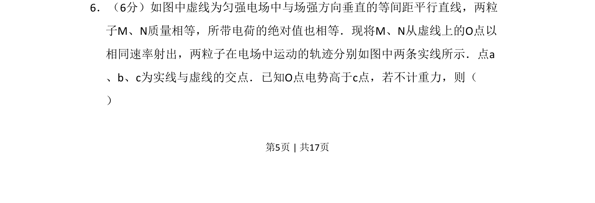
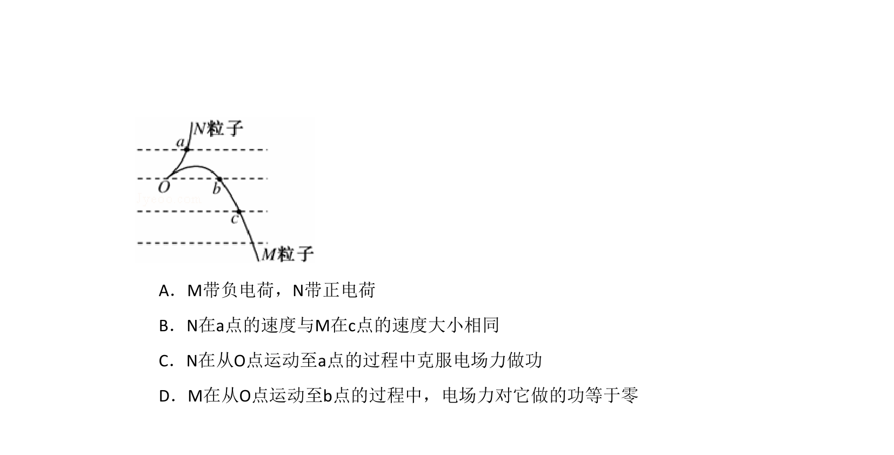
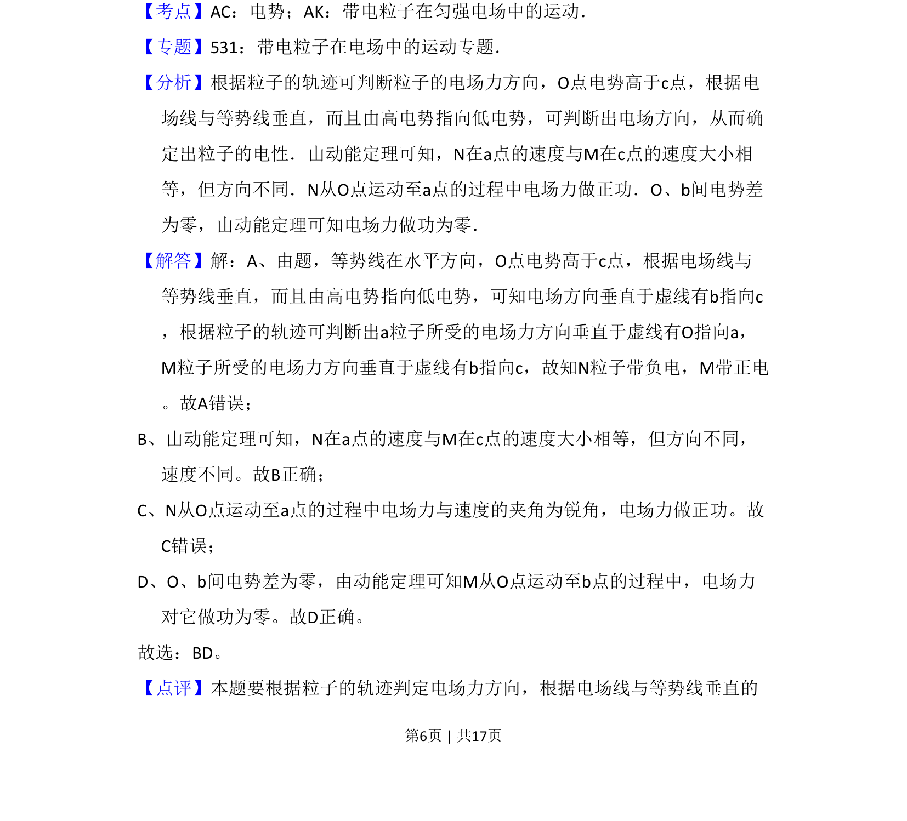

## 题面

## 摘要

两带电粒子在匀强电场中运动，根据轨迹和电势高低分析粒子受力与能量变化。

## 关联考点

- [[277-电场强度|电场强度]]
- [[308-电势|电势]]
- [[251-动能定理|动能定理]]
- [[229-牛顿第二定律|牛顿第二定律]]

## 答案与解析

> 📄 原 PDF 第 5 页：`素材/真题/吉林/2008-2024·（吉林）物理高考真题/2009年高考物理试卷（全国卷Ⅱ）（解析卷）.pdf`
