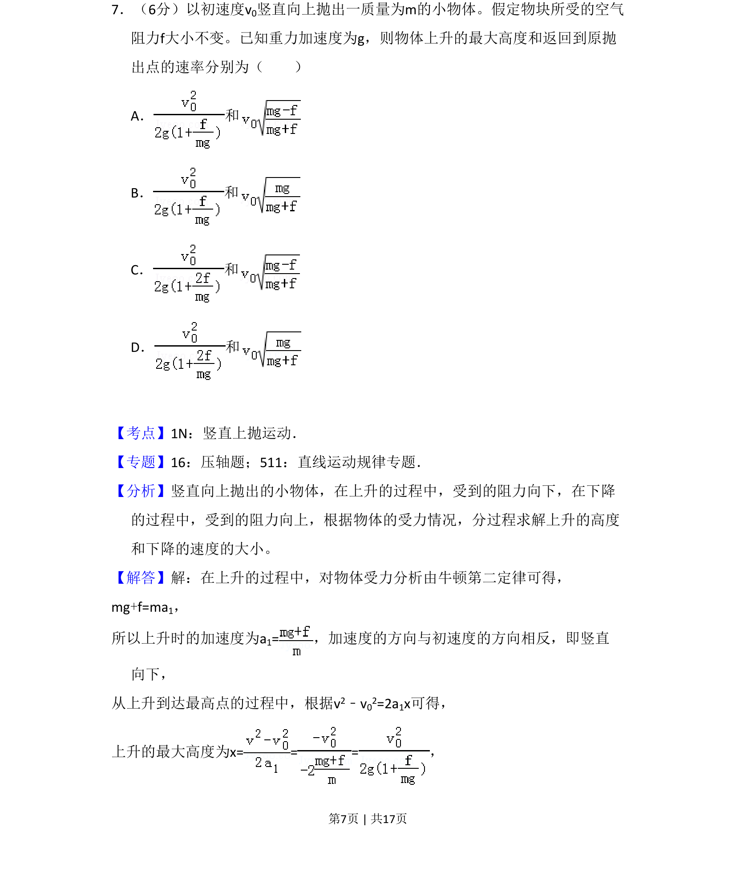

## 题面

## 摘要

竖直上抛运动中考虑空气阻力，求解物体上升最大高度和落回原处速率。

## 关联考点

- [[竖直上抛运动]]
- [[229-牛顿第二定律|牛顿第二定律]]
- [[215-匀变速直线运动|匀变速直线运动]]
- [[有阻力运动]]

## 答案与解析

> 📄 原 PDF 第 7 页：`素材/真题/吉林/2008-2024·（吉林）物理高考真题/2009年高考物理试卷（全国卷Ⅱ）（解析卷）.pdf`
