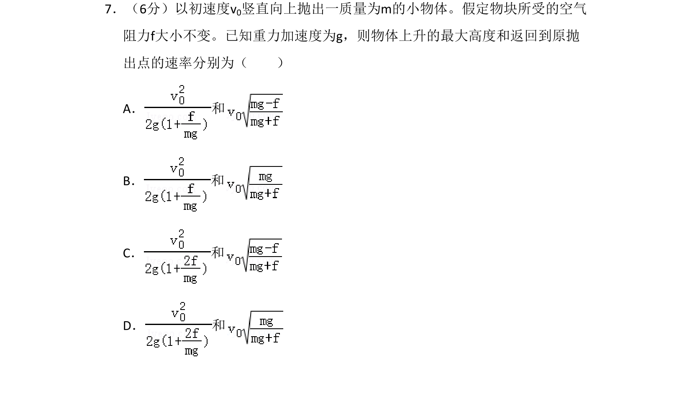
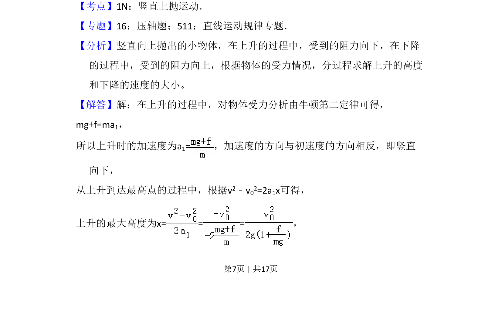
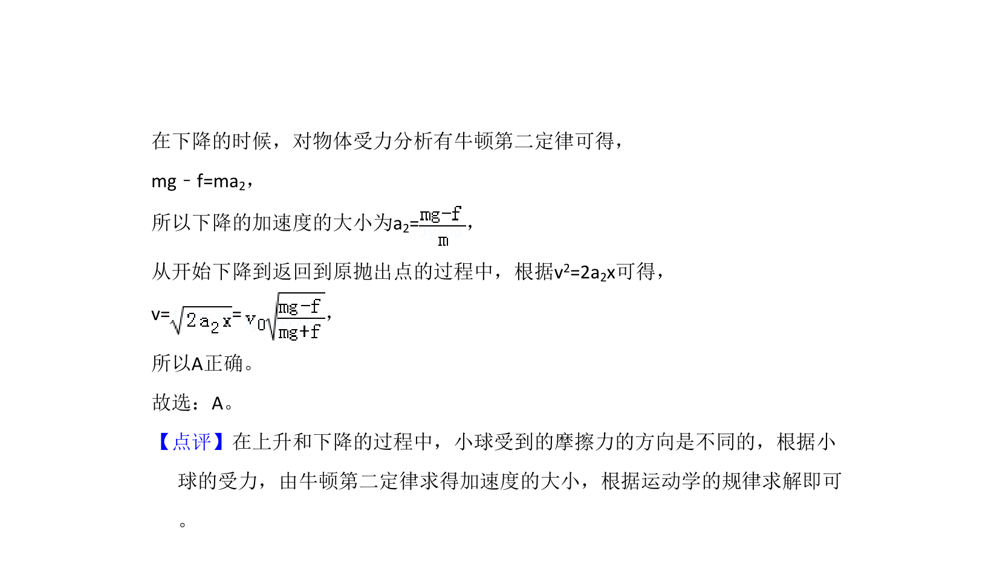

## 题面

## 摘要

竖直上抛运动中考虑空气阻力，求解物体上升最大高度和落回原处速率。

## 关联考点

- [[706-竖直上抛运动|竖直上抛运动]]
- [[229-牛顿第二定律|牛顿第二定律]]
- [[215-匀变速直线运动|匀变速直线运动]]
- [[626-有阻力运动|有阻力运动]]

## 答案与解析

> 📄 原 PDF 第 7 页：`素材/真题/吉林/2008-2024·（吉林）物理高考真题/2009年高考物理试卷（全国卷Ⅱ）（解析卷）.pdf`

<!-- 题干文本-start -->
## 题干文本
7．（6分）以初速度v0竖直向上抛出一质量为m的小物体。假定物块所受的空气
阻力f大小不变。已知重力加速度为g，则物体上升的最大高度和返回到原抛
出点的速率分别为（　　）
A． 和
B． 和
C． 和
D． 和
<!-- 题干文本-end -->

<!-- 解析文本-start -->
## 解析文本
【考点】1N：竖直上抛运动．菁优网版权所有
【专题】16：压轴题；511：直线运动规律专题．
【分析】竖直向上抛出的小物体，在上升的过程中，受到的阻力向下，在下降
的过程中，受到的阻力向上，根据物体的受力情况，分过程求解上升的高度
和下降的速度的大小。
【解答】解：在上升的过程中，对物体受力分析由牛顿第二定律可得，
mg+f=ma1，
所以上升时的加速度为a1=，加速度的方向与初速度的方向相反，即竖直
向下，
从上升到达最高点的过程中，根据v2﹣v02=2a1x可得，
上升的最大高度为x= = =，
<!-- 解析文本-end -->
