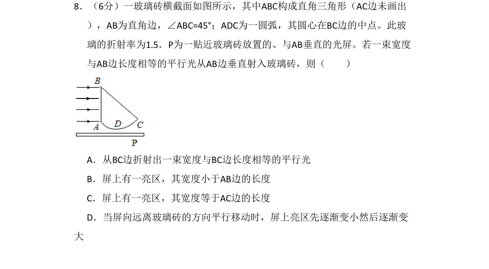
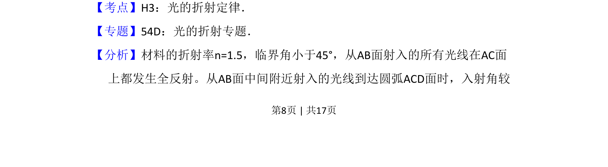
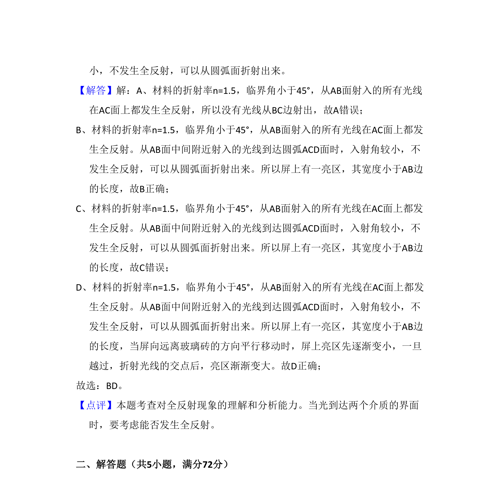

## 题面

## 摘要

一束平行光垂直射入玻璃砖，经全反射和折射后在屏上形成亮区，分析亮区宽度及移动变化

## 关联考点

- [[光的折射定律]]
- [[343-全反射|全反射]]
- [[336-临界角|临界角]]

## 答案与解析

> 📄 原 PDF 第 8 页：`素材/真题/吉林/2008-2024·（吉林）物理高考真题/2009年高考物理试卷（全国卷Ⅱ）（解析卷）.pdf`
