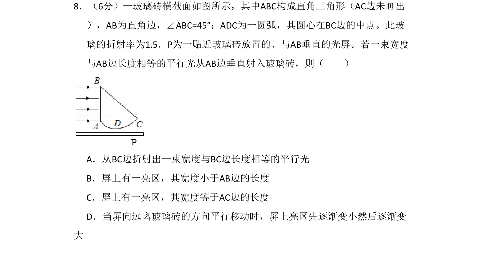
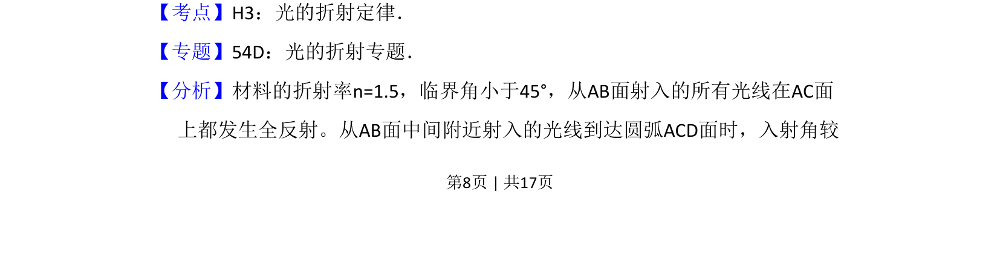
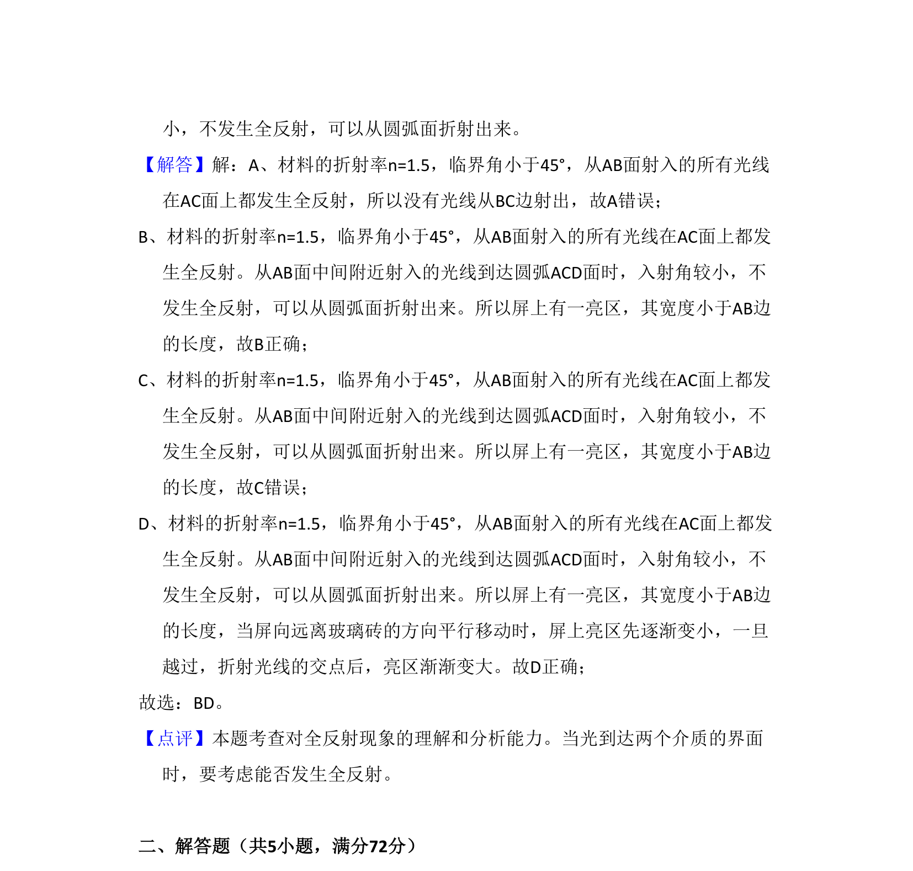

## 题面

## 摘要

一束平行光垂直射入玻璃砖，经全反射和折射后在屏上形成亮区，分析亮区宽度及移动变化

## 关联考点

- [[520-光的折射定律|光的折射定律]]
- [[343-全反射|全反射]]
- [[336-临界角|临界角]]

## 答案与解析

> 📄 原 PDF 第 8 页：`素材/真题/吉林/2008-2024·（吉林）物理高考真题/2009年高考物理试卷（全国卷Ⅱ）（解析卷）.pdf`

<!-- 题干文本-start -->
## 题干文本
8．（6分）一玻璃砖横截面如图所示，其中ABC构成直角三角形（AC边未画出
），AB为直角边，∠ABC=45°；ADC为一圆弧，其圆心在BC边的中点。此玻
璃的折射率为1.5．P为一贴近玻璃砖放置的、与AB垂直的光屏。若一束宽度
与AB边长度相等的平行光从AB边垂直射入玻璃砖，则（　　）
A．从BC边折射出一束宽度与BC边长度相等的平行光
B．屏上有一亮区，其宽度小于AB边的长度
C．屏上有一亮区，其宽度等于AC边的长度
D．当屏向远离玻璃砖的方向平行移动时，屏上亮区先逐渐变小然后逐渐变
大
<!-- 题干文本-end -->

<!-- 解析文本-start -->
## 解析文本
【考点】H3：光的折射定律．菁优网版权所有
【专题】54D：光的折射专题．
【分析】材料的折射率n=1.5，临界角小于45°，从AB面射入的所有光线在AC面
上都发生全反射。从AB面中间附近射入的光线到达圆弧ACD面时，入射角较
<!-- 解析文本-end -->
