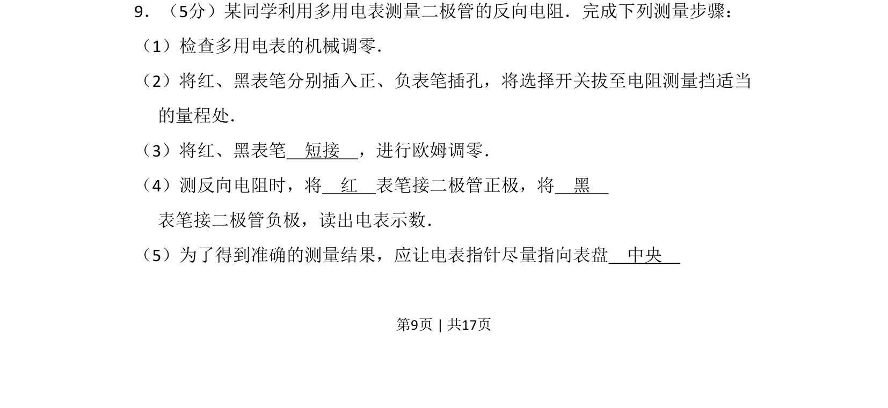
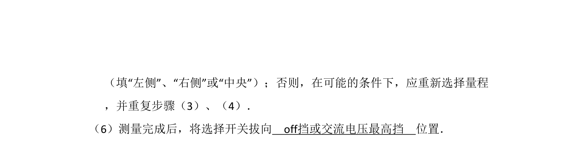
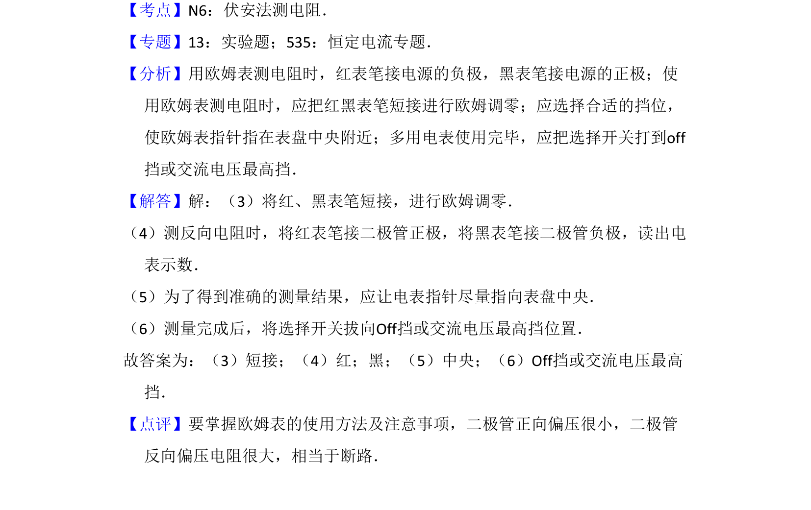

## 题面

## 摘要

考查多用电表欧姆调零及测量二极管反向电阻的操作步骤

## 关联考点

- [[784-多用电表的使用|多用电表使用]]
- [[631-欧姆调零|欧姆调零]]
- [[509-二极管反向电阻测量|二极管反向电阻测量]]

## 答案与解析

> 📄 原 PDF 第 9 页：`素材/真题/吉林/2008-2024·（吉林）物理高考真题/2009年高考物理试卷（全国卷Ⅱ）（解析卷）.pdf`

<!-- 题干文本-start -->
## 题干文本
9．（5分）某同学利用多用电表测量二极管的反向电阻．完成下列测量步骤：
（1）检查多用电表的机械调零．
（2）将红、黑表笔分别插入正、负表笔插孔，将选择开关拔至电阻测量挡适当
的量程处．
（3）将红、黑表笔　短接　，进行欧姆调零．
（4）测反向电阻时，将　红　表笔接二极管正极，将　黑　
表笔接二极管负极，读出电表示数．
（5）为了得到准确的测量结果，应让电表指针尽量指向表盘　中央
<!-- 题干文本-end -->

<!-- 解析文本-start -->
## 解析文本

<!-- 解析文本-end -->
