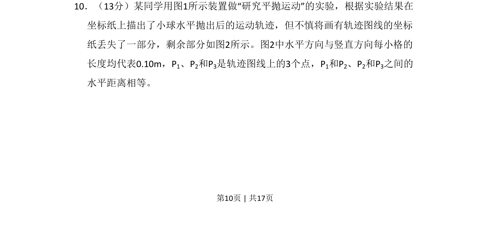
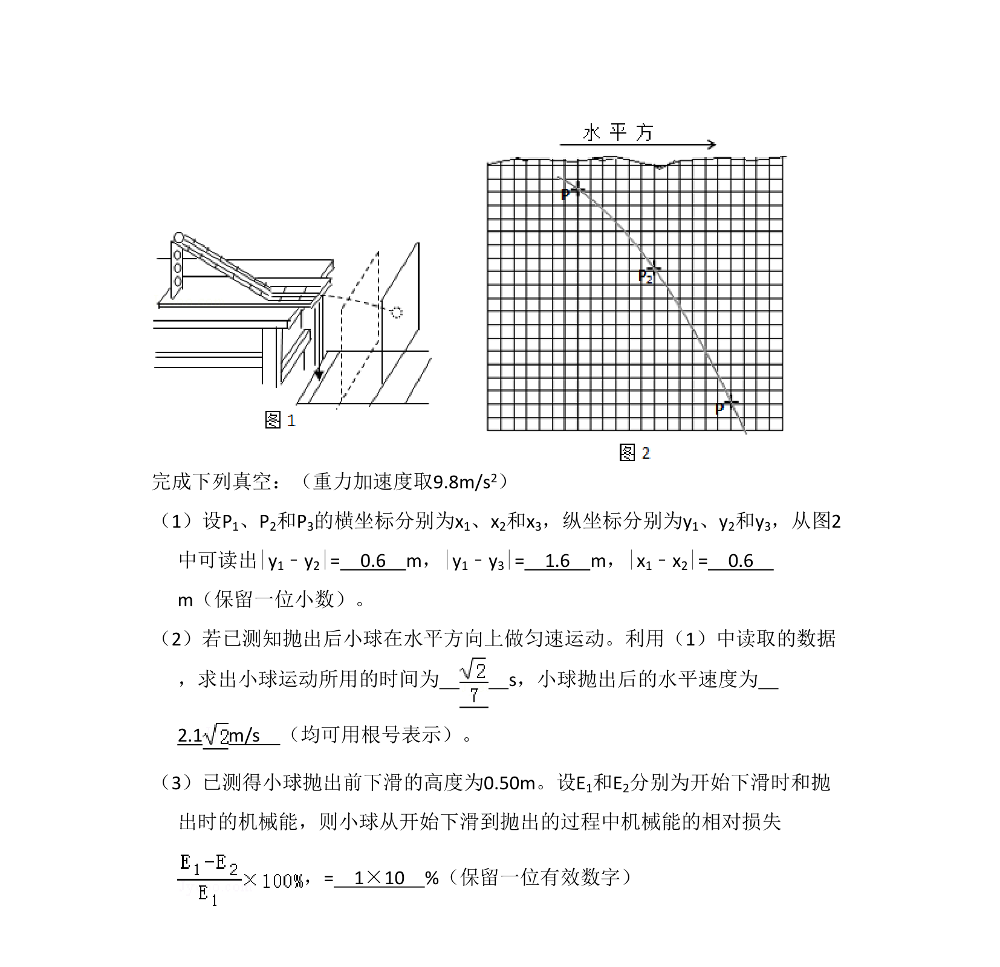
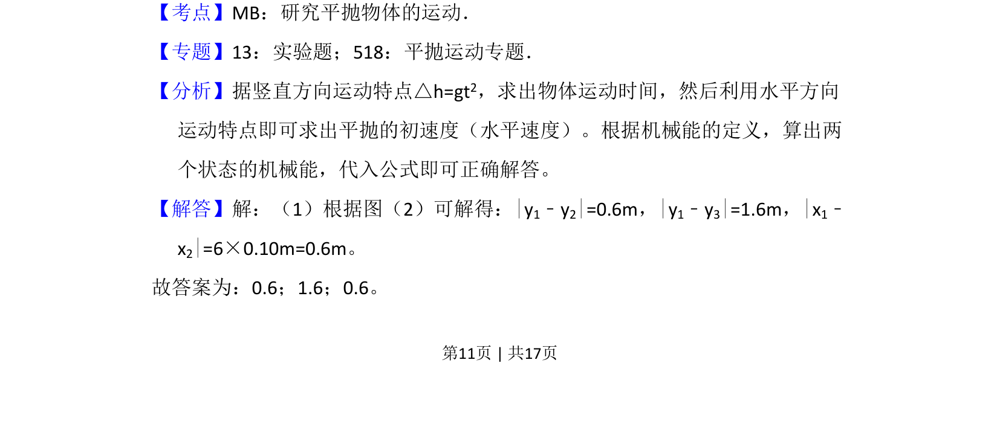
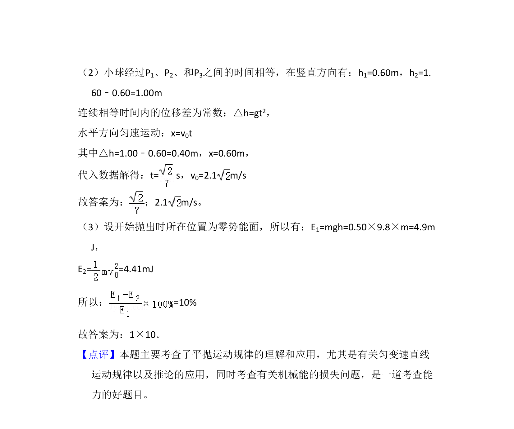

## 题面

## 摘要

通过分析平抛运动轨迹的坐标纸残图，利用水平与竖直方向分运动规律进行相关计算。

## 关联考点

- [[227-抛物线|抛物线]]
- [[466-坐标测量|坐标测量]]
- [[732-运动分解|运动分解]]
- [[555-数据推理|数据推理]]

## 答案与解析

> 📄 原 PDF 第 10 页：`素材/真题/吉林/2008-2024·（吉林）物理高考真题/2009年高考物理试卷（全国卷Ⅱ）（解析卷）.pdf`
