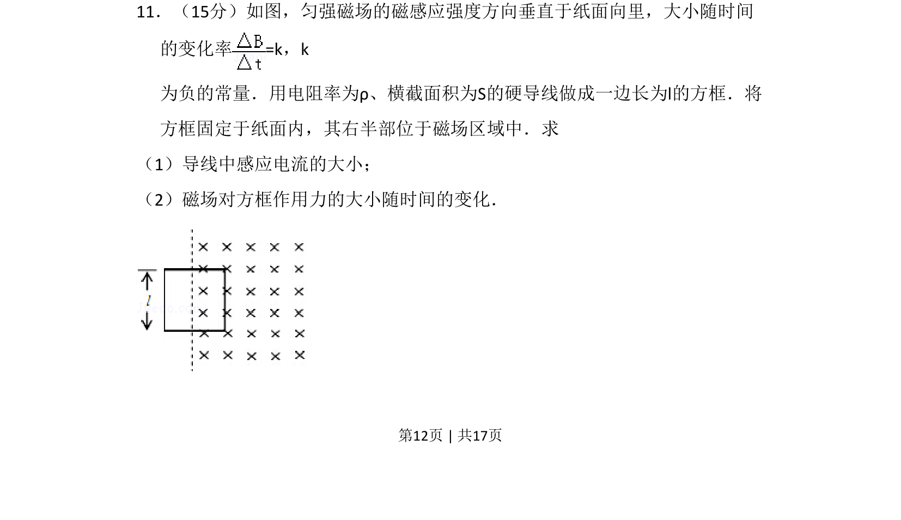
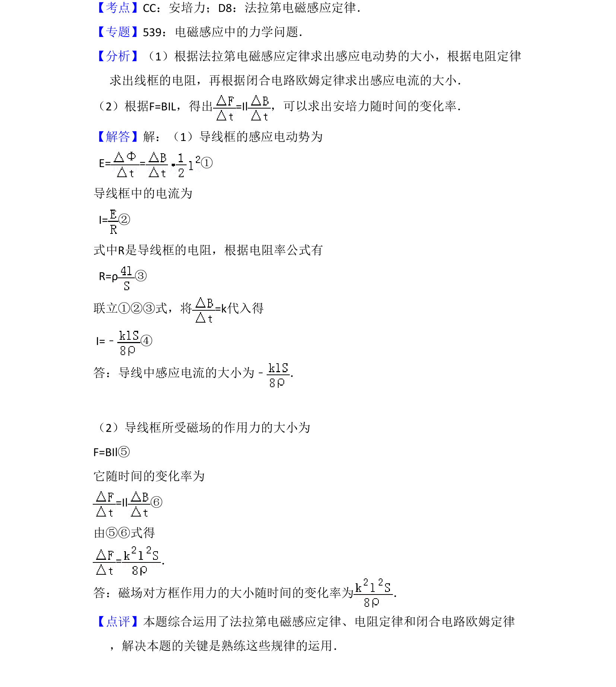

## 题面

## 摘要

导线在变化磁场中产生感应电流，结合电阻定律和安培力公式求解电流大小及磁场力变化率。

## 关联考点

- [[395-法拉第电磁感应定律|法拉第电磁感应定律]]
- [[318-电阻定律|电阻定律]]
- [[188-磁场对通电导体的作用|安培力]]
- [[变化率]]

## 答案与解析

> 📄 原 PDF 第 12 页：`素材/真题/吉林/2008-2024·（吉林）物理高考真题/2009年高考物理试卷（全国卷Ⅱ）（解析卷）.pdf`
