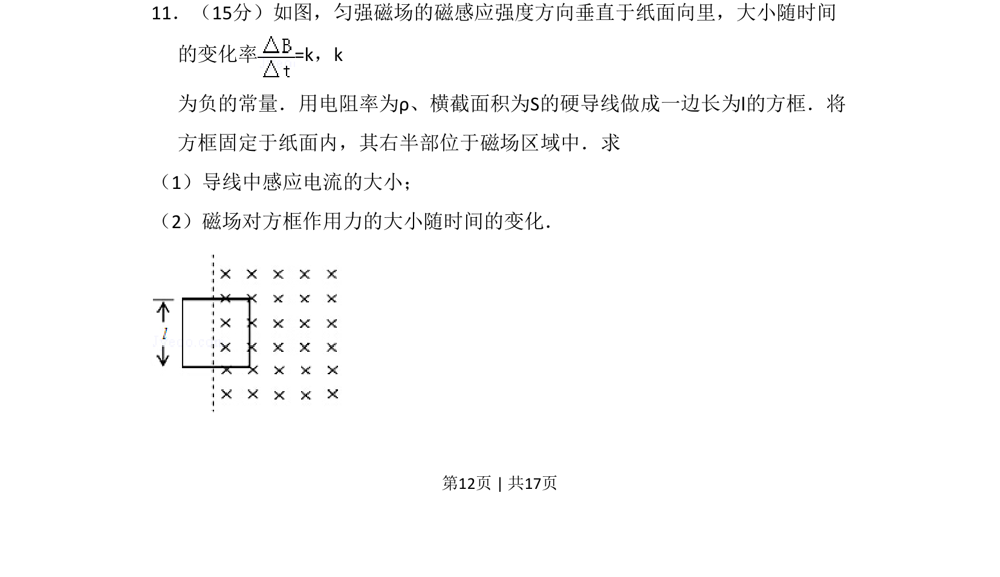
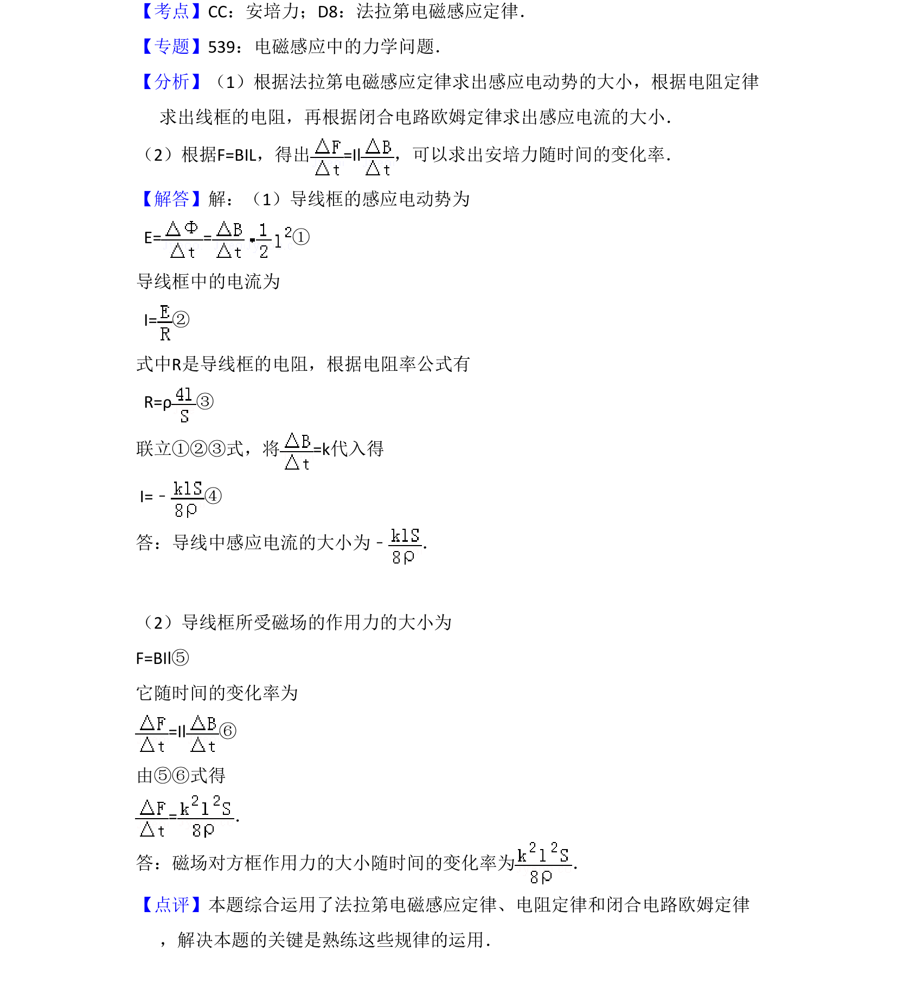

## 题面

## 摘要

导线在变化磁场中产生感应电流，结合电阻定律和安培力公式求解电流大小及磁场力变化率。

## 关联考点

- [[395-法拉第电磁感应定律|法拉第电磁感应定律]]
- [[318-电阻定律|电阻定律]]
- [[188-磁场对通电导体的作用|安培力]]
- [[555-变化率|变化率]]

## 答案与解析

> 📄 原 PDF 第 12 页：`素材/真题/吉林/2008-2024·（吉林）物理高考真题/2009年高考物理试卷（全国卷Ⅱ）（解析卷）.pdf`

<!-- 题干文本-start -->
## 题干文本
11．（15分）如图，匀强磁场的磁感应强度方向垂直于纸面向里，大小随时间
的变化率=k，k 
为负的常量．用电阻率为ρ、横截面积为S的硬导线做成一边长为l的方框．将
方框固定于纸面内，其右半部位于磁场区域中．求
（1）导线中感应电流的大小；
（2）磁场对方框作用力的大小随时间的变化．
<!-- 题干文本-end -->

<!-- 解析文本-start -->
## 解析文本

<!-- 解析文本-end -->
