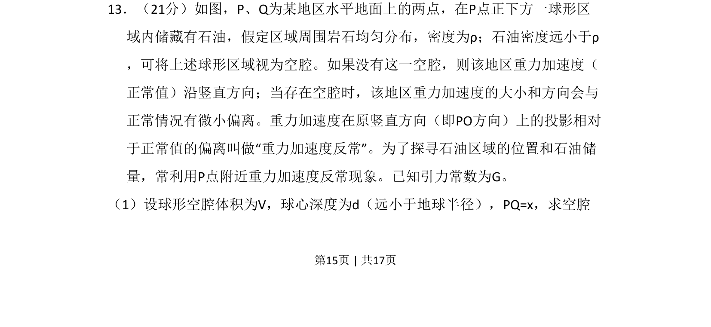
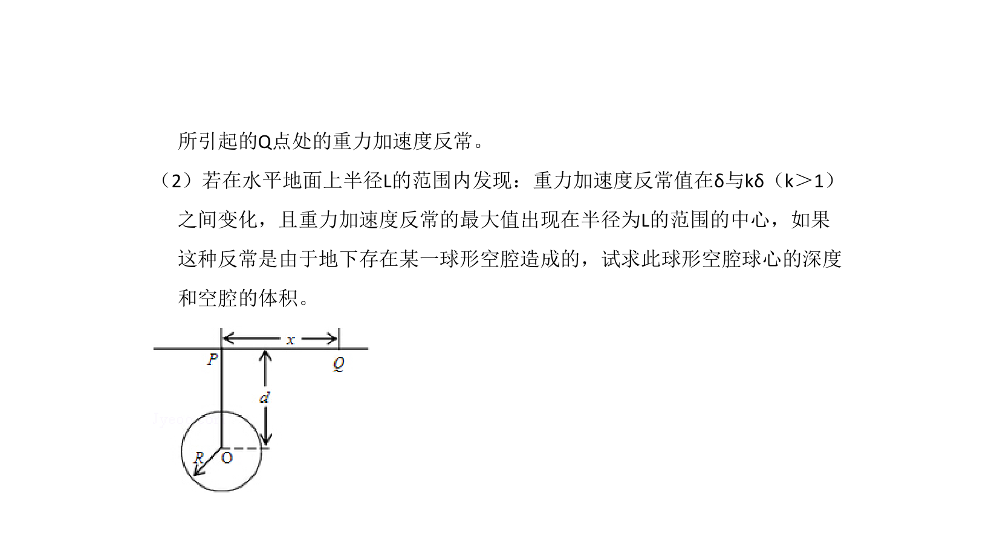
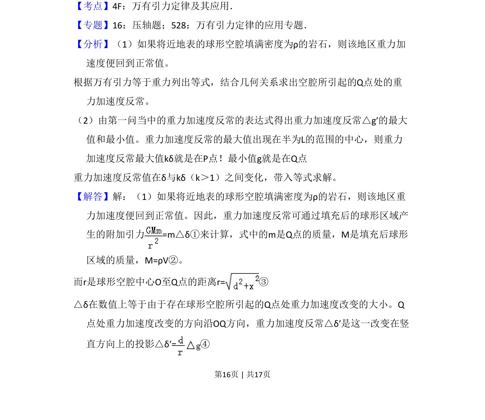
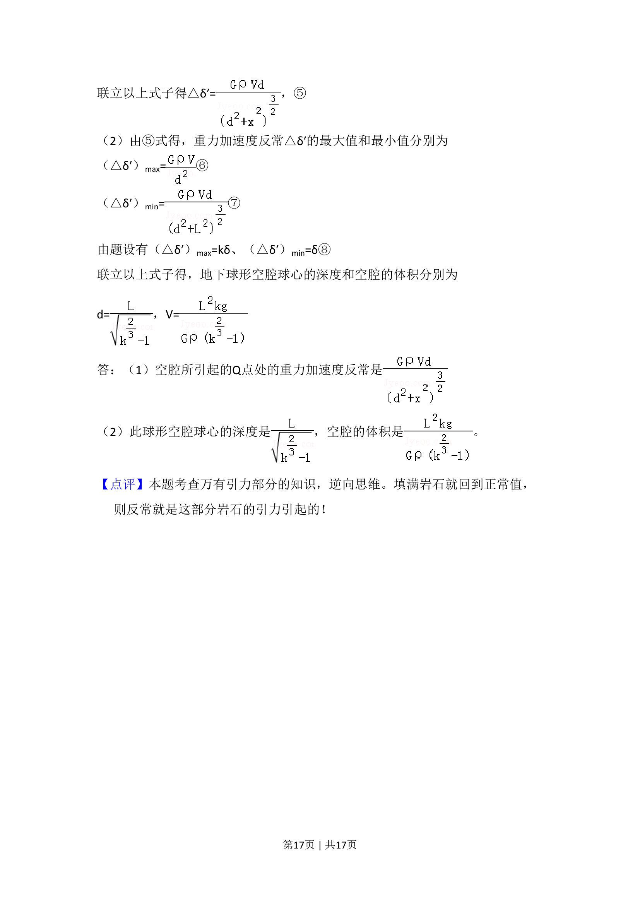

## 题面

## 摘要

球形空腔引起重力加速度反常的引力计算模型

## 关联考点

- [[246-万有引力定律|万有引力定律]]
- [[115-重力加速度-初中|重力加速度]]
- [[575-填补法|填补法]]
- [[610-微元法|微元法]]

## 答案与解析

> 📄 原 PDF 第 15 页：`素材/真题/吉林/2008-2024·（吉林）物理高考真题/2009年高考物理试卷（全国卷Ⅱ）（解析卷）.pdf`

<!-- 题干文本-start -->
## 题干文本
13．（21分）如图，P、Q为某地区水平地面上的两点，在P点正下方一球形区
域内储藏有石油，假定区域周围岩石均匀分布，密度为ρ；石油密度远小于ρ
，可将上述球形区域视为空腔。如果没有这一空腔，则该地区重力加速度（
正常值）沿竖直方向；当存在空腔时，该地区重力加速度的大小和方向会与
正常情况有微小偏离。重力加速度在原竖直方向（即PO方向）上的投影相对
于正常值的偏离叫做“重力加速度反常”。为了探寻石油区域的位置和石油储
量，常利用P点附近重力加速度反常现象。已知引力常数为G。
（1）设球形空腔体积为V，球心深度为d（远小于地球半径），PQ=x，求空腔
<!-- 题干文本-end -->

<!-- 解析文本-start -->
## 解析文本

<!-- 解析文本-end -->
