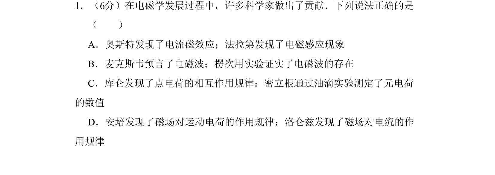
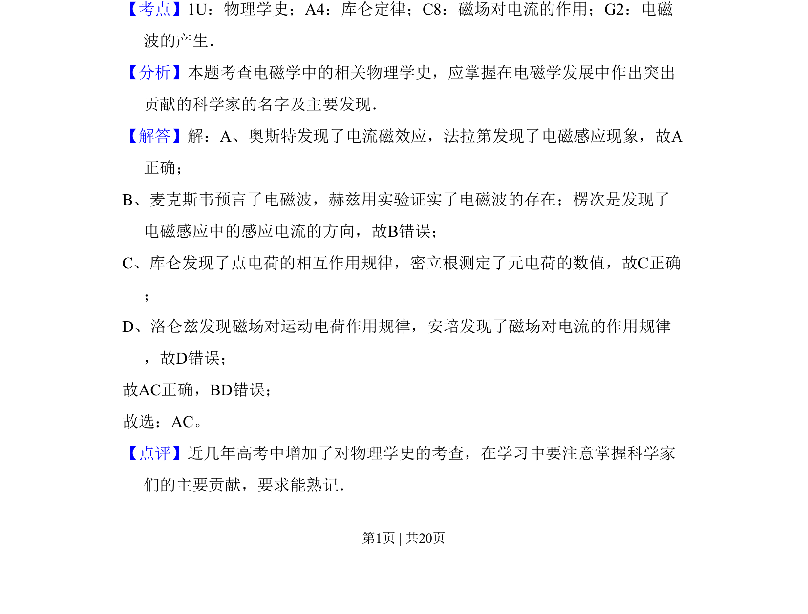

## 题面

## 摘要

本题考查电磁学发展史中科学家的贡献，需判断关于物理学家及其发现的正确说法。

## 关联考点

- [[482-物理学史|物理学史]]
- [[263-库仑定律|库仑定律]]
- [[321-磁场对电流的作用|磁场对电流的作用]]
- [[687-电磁波的产生|电磁波的产生]]

## 答案与解析

> 📄 原 PDF 第 1 页：`素材/真题/吉林/2008-2024·（吉林）物理高考真题/2010年高考物理试卷（新课标Ⅰ）（解析卷）.pdf`
