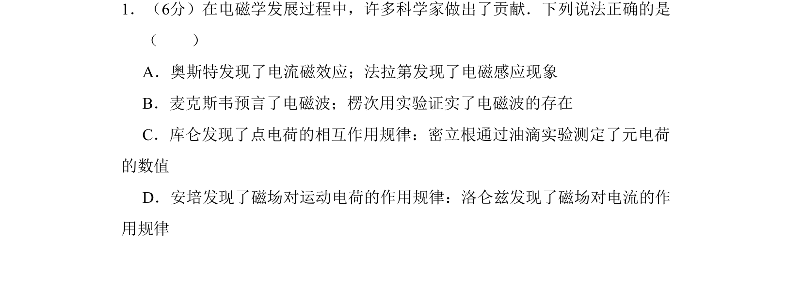
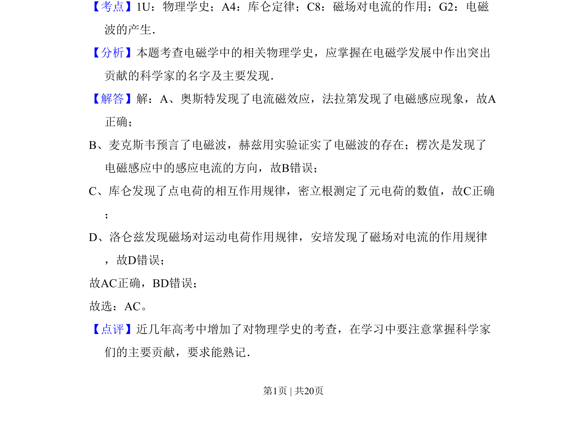

## 题面

## 摘要

本题考查电磁学发展史中科学家的贡献，需判断关于物理学家及其发现的正确说法。

## 关联考点

- [[482-物理学史|物理学史]]
- [[263-库仑定律|库仑定律]]
- [[321-磁场对电流的作用|磁场对电流的作用]]
- [[687-电磁波的产生|电磁波的产生]]

## 答案与解析

> 📄 原 PDF 第 1 页：`素材/真题/吉林/2008-2024·（吉林）物理高考真题/2010年高考物理试卷（新课标Ⅰ）（解析卷）.pdf`

<!-- 题干文本-start -->
## 题干文本
1．（6分）在电磁学发展过程中，许多科学家做出了贡献．下列说法正确的是
（　　）
A．奥斯特发现了电流磁效应；法拉第发现了电磁感应现象
B．麦克斯韦预言了电磁波；楞次用实验证实了电磁波的存在
C．库仑发现了点电荷的相互作用规律：密立根通过油滴实验测定了元电荷
的数值
D．安培发现了磁场对运动电荷的作用规律：洛仑兹发现了磁场对电流的作
用规律
<!-- 题干文本-end -->

<!-- 解析文本-start -->
## 解析文本
【考点】1U：物理学史；A4：库仑定律；C8：磁场对电流的作用；G2：电磁
波的产生．菁优网版权所有
【分析】本题考查电磁学中的相关物理学史，应掌握在电磁学发展中作出突出
贡献的科学家的名字及主要发现．
【解答】解：A、奥斯特发现了电流磁效应，法拉第发现了电磁感应现象，故A
正确；
B、麦克斯韦预言了电磁波，赫兹用实验证实了电磁波的存在；楞次是发现了
电磁感应中的感应电流的方向，故B错误；
C、库仑发现了点电荷的相互作用规律，密立根测定了元电荷的数值，故C正确
；
D、洛仑兹发现磁场对运动电荷作用规律，安培发现了磁场对电流的作用规律
，故D错误；
故AC正确，BD错误；
故选：AC。
【点评】近几年高考中增加了对物理学史的考查，在学习中要注意掌握科学家
们的主要贡献，要求能熟记．
<!-- 解析文本-end -->
