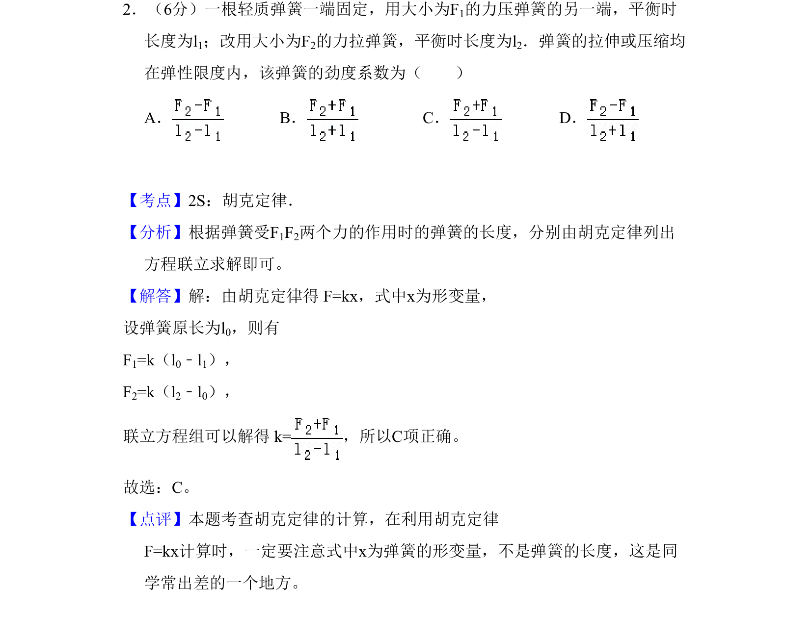
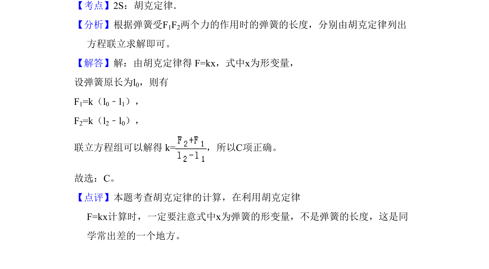

## 题面

## 摘要

弹簧劲度系数计算，考查胡克定律中弹力与形变量的关系

## 关联考点

- [[233-胡克定律|胡克定律]]
- [[078-弹力|弹力]]
- [[609-形变量|形变量]]
- [[540-劲度系数|劲度系数]]

## 答案与解析

> 📄 原 PDF 第 2 页：`素材/真题/吉林/2008-2024·（吉林）物理高考真题/2010年高考物理试卷（新课标Ⅰ）（解析卷）.pdf`
