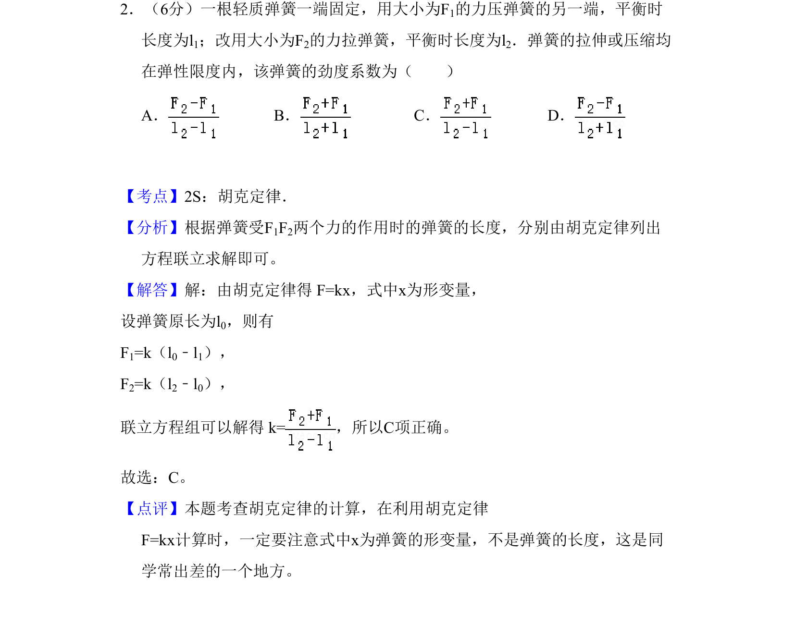
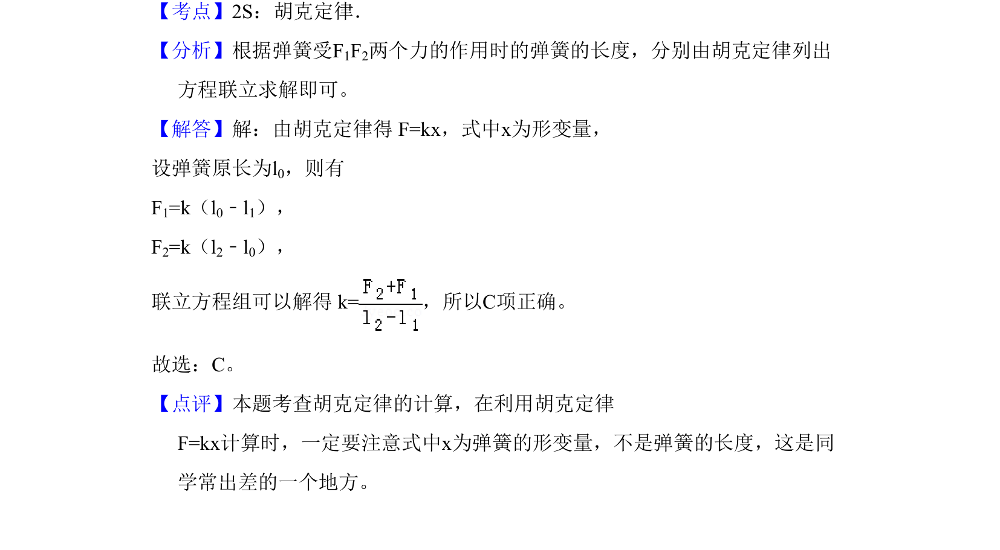

## 题面

## 摘要

弹簧劲度系数计算，考查胡克定律中弹力与形变量的关系

## 关联考点

- [[233-胡克定律|胡克定律]]
- [[078-弹力|弹力]]
- [[609-形变量|形变量]]
- [[540-劲度系数|劲度系数]]

## 答案与解析

> 📄 原 PDF 第 2 页：`素材/真题/吉林/2008-2024·（吉林）物理高考真题/2010年高考物理试卷（新课标Ⅰ）（解析卷）.pdf`

<!-- 题干文本-start -->
## 题干文本
2．（6分）一根轻质弹簧一端固定，用大小为F1的力压弹簧的另一端，平衡时
长度为l1；改用大小为F2的力拉弹簧，平衡时长度为l2．弹簧的拉伸或压缩均
在弹性限度内，该弹簧的劲度系数为（　　）
A．B．C．D．
<!-- 题干文本-end -->

<!-- 解析文本-start -->
## 解析文本
【考点】2S：胡克定律．菁优网版权所有
【分析】根据弹簧受F1F2两个力的作用时的弹簧的长度，分别由胡克定律列出
方程联立求解即可。
【解答】解：由胡克定律得 F=kx，式中x为形变量，
设弹簧原长为l0，则有
F1=k（l0﹣l1），
F2=k（l2﹣l0），
联立方程组可以解得 k=，所以C项正确。
故选：C。
【点评】本题考查胡克定律的计算，在利用胡克定律 
F=kx计算时，一定要注意式中x为弹簧的形变量，不是弹簧的长度，这是同
学常出差的一个地方。
<!-- 解析文本-end -->
