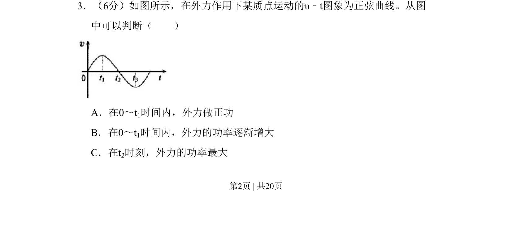
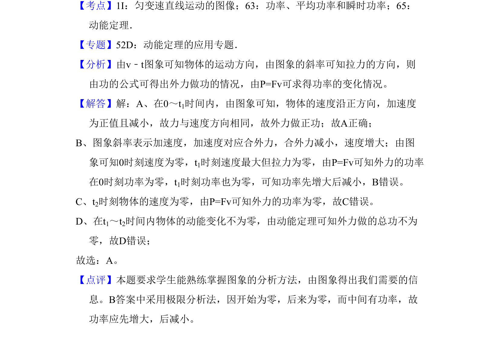

## 题面

## 摘要

根据质点做简谐运动的v-t图象，判断外力做功的正负及功率大小变化情况。

## 关联考点

- [[v-t图象]]
- [[373-简谐运动|简谐运动]]
- [[062-功-物理|功]]
- [[063-功率|功率]]

## 答案与解析

> 📄 原 PDF 第 2 页：`素材/真题/吉林/2008-2024·（吉林）物理高考真题/2010年高考物理试卷（新课标Ⅰ）（解析卷）.pdf`
