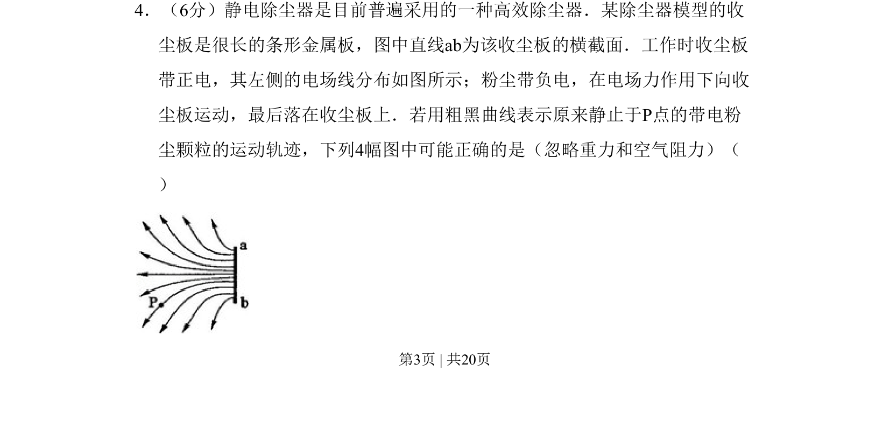
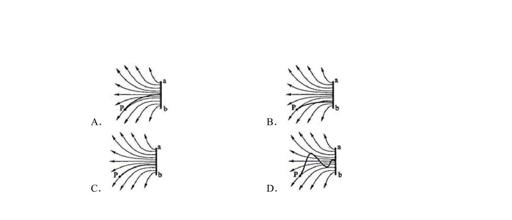
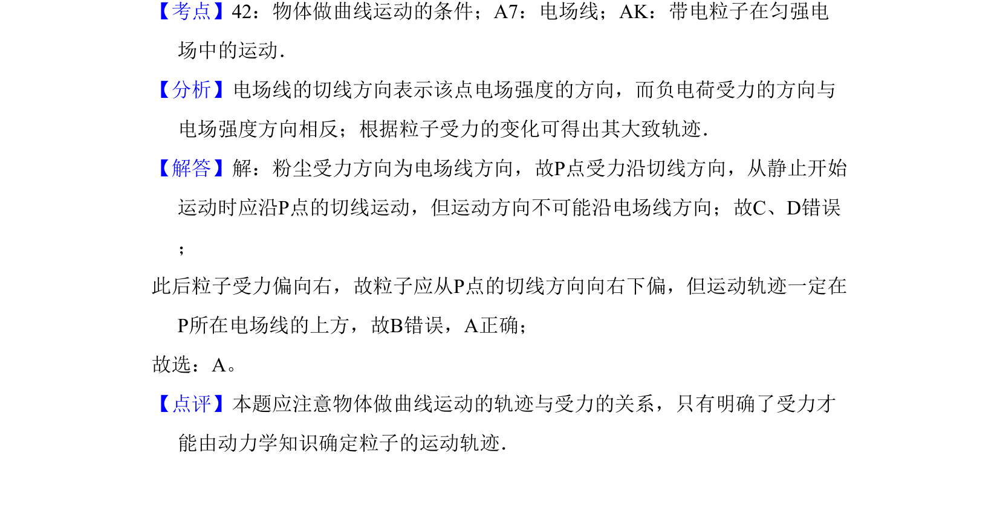

## 题面

## 摘要

该题考查静电除尘器中带电粉尘颗粒在电场力作用下的运动轨迹判断。

## 关联考点

- [[278-电场线|电场线]]
- [[736-运动轨迹|运动轨迹]]
- [[460-受力分析|受力分析]]

## 答案与解析

> 📄 原 PDF 第 3 页：`素材/真题/吉林/2008-2024·（吉林）物理高考真题/2010年高考物理试卷（新课标Ⅰ）（解析卷）.pdf`
