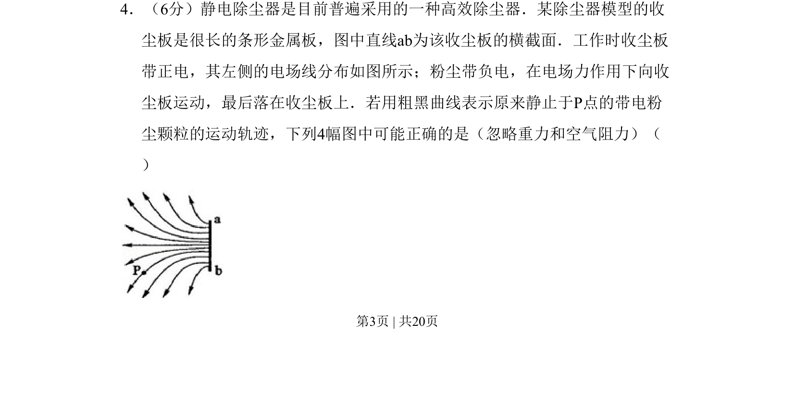
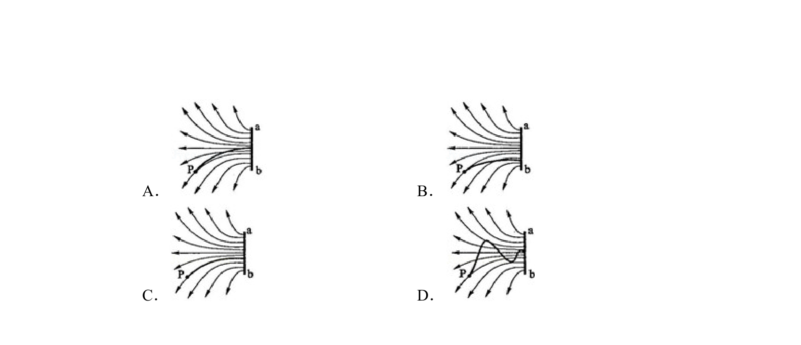
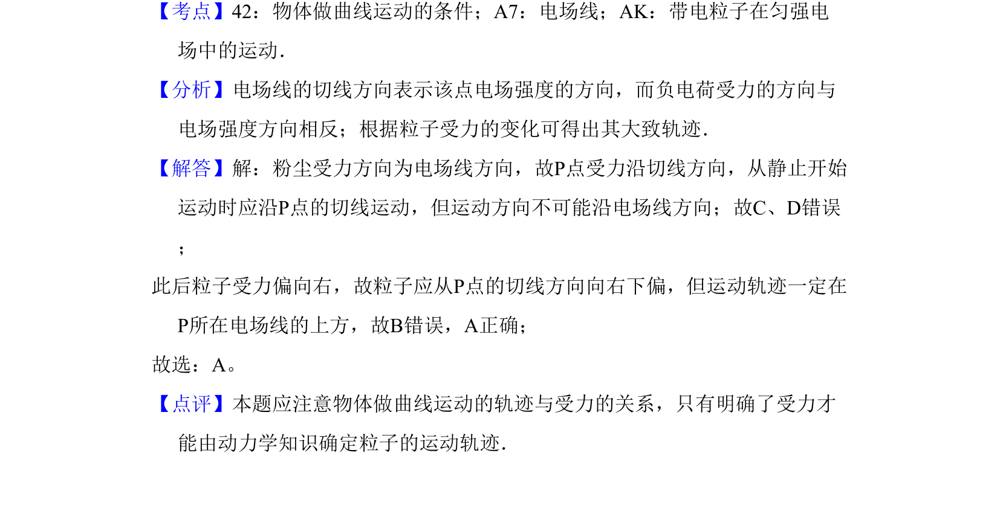

## 题面

## 摘要

该题考查静电除尘器中带电粉尘颗粒在电场力作用下的运动轨迹判断。

## 关联考点

- [[278-电场线|电场线]]
- [[736-运动轨迹|运动轨迹]]
- [[460-受力分析|受力分析]]

## 答案与解析

> 📄 原 PDF 第 3 页：`素材/真题/吉林/2008-2024·（吉林）物理高考真题/2010年高考物理试卷（新课标Ⅰ）（解析卷）.pdf`

<!-- 题干文本-start -->
## 题干文本
4．（6分）静电除尘器是目前普遍采用的一种高效除尘器．某除尘器模型的收
尘板是很长的条形金属板，图中直线ab为该收尘板的横截面．工作时收尘板
带正电，其左侧的电场线分布如图所示；粉尘带负电，在电场力作用下向收
尘板运动，最后落在收尘板上．若用粗黑曲线表示原来静止于P点的带电粉
尘颗粒的运动轨迹，下列4幅图中可能正确的是（忽略重力和空气阻力）（　　
）
<!-- 题干文本-end -->

<!-- 解析文本-start -->
## 解析文本

<!-- 解析文本-end -->
