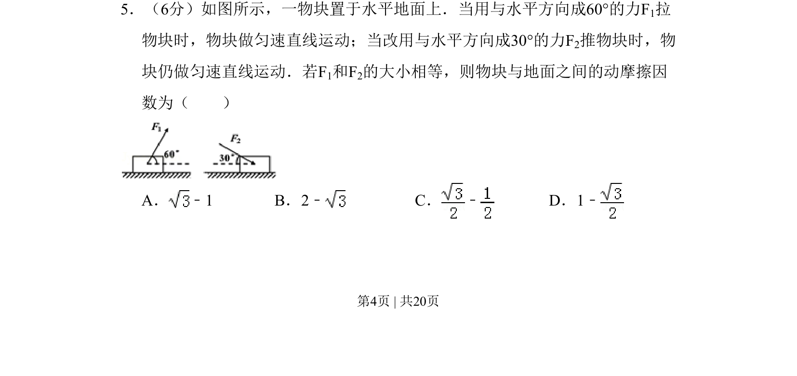

## 题面

## 摘要

该题通过两种拉推情境的平衡条件，建立方程组求解动摩擦因数。

## 关联考点

- [[力的合成与分解]]
- [[正交分解法]]
- [[208-共点力平衡|共点力平衡]]
- [[097-滑动摩擦力|滑动摩擦力]]

## 答案与解析

> 📄 原 PDF 第 4 页：`素材/真题/吉林/2008-2024·（吉林）物理高考真题/2010年高考物理试卷（新课标Ⅰ）（解析卷）.pdf`
