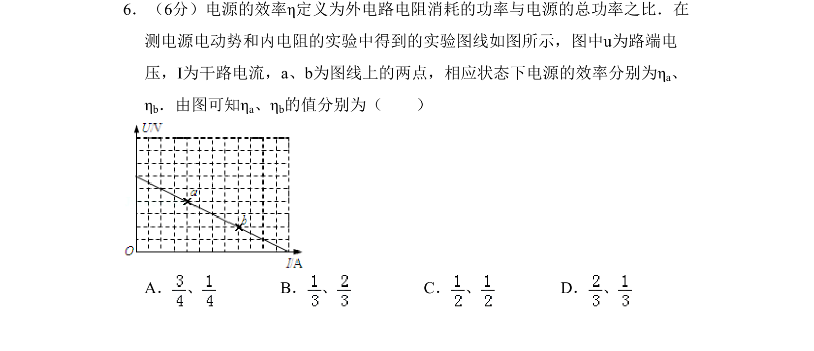
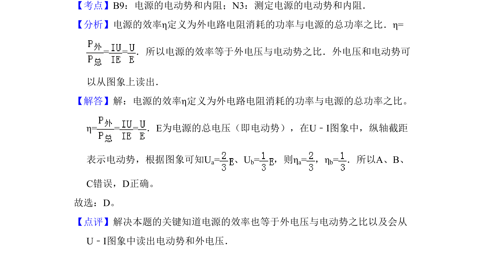

## 题面

## 摘要

本题考查通过U-I图像计算电源效率，结合外电压与电动势之比进行求解。

## 关联考点

- [[685-电源效率|电源效率]]
- [[307-电动势|电动势]]
- [[496-U-I图像|U-I图像]]

## 答案与解析

> 📄 原 PDF 第 6 页：`素材/真题/吉林/2008-2024·（吉林）物理高考真题/2010年高考物理试卷（新课标Ⅰ）（解析卷）.pdf`
