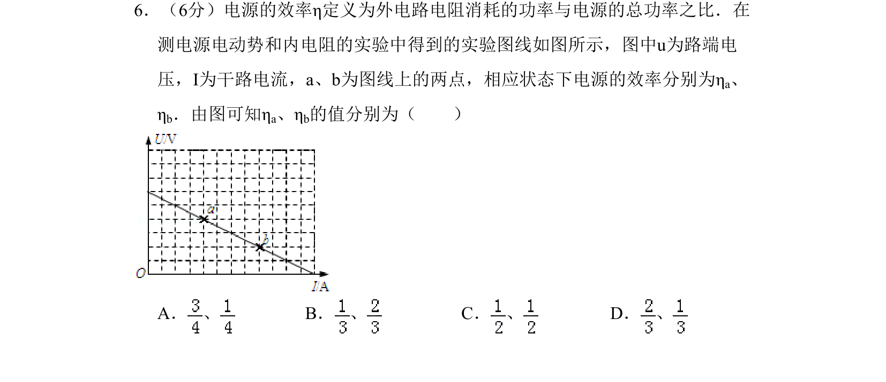
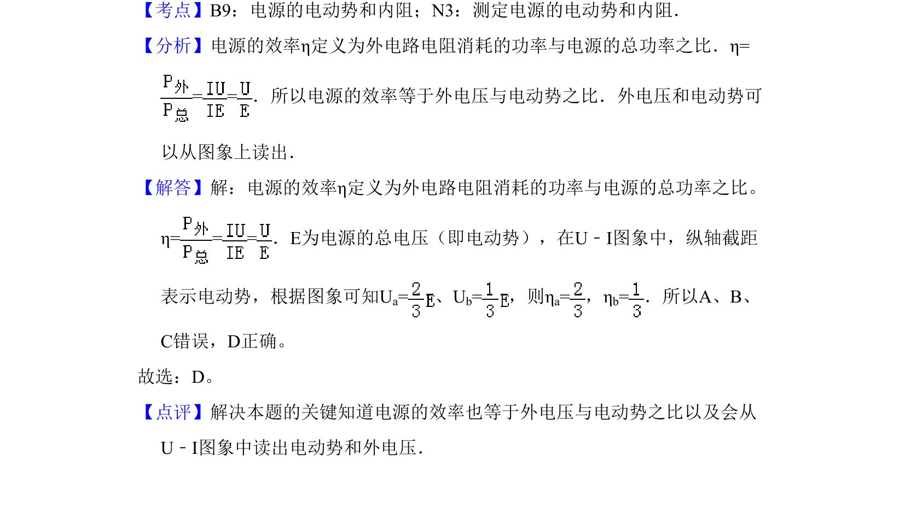

## 题面

## 摘要

本题考查通过U-I图像计算电源效率，结合外电压与电动势之比进行求解。

## 关联考点

- [[685-电源效率|电源效率]]
- [[307-电动势|电动势]]
- [[496-U-I图像|U-I图像]]

## 答案与解析

> 📄 原 PDF 第 6 页：`素材/真题/吉林/2008-2024·（吉林）物理高考真题/2010年高考物理试卷（新课标Ⅰ）（解析卷）.pdf`

<!-- 题干文本-start -->
## 题干文本
6．（6分）电源的效率η定义为外电路电阻消耗的功率与电源的总功率之比．在
测电源电动势和内电阻的实验中得到的实验图线如图所示，图中u为路端电
压，I为干路电流，a、b为图线上的两点，相应状态下电源的效率分别为ηa、
ηb．由图可知ηa、ηb的值分别为（　　）
A． 、B． 、C． 、D． 、
<!-- 题干文本-end -->

<!-- 解析文本-start -->
## 解析文本
【考点】B9：电源的电动势和内阻；N3：测定电源的电动势和内阻．菁优网版权所有
【分析】电源的效率η定义为外电路电阻消耗的功率与电源的总功率之比．η=
= =．所以电源的效率等于外电压与电动势之比．外电压和电动势可
以从图象上读出．
【解答】解：电源的效率η定义为外电路电阻消耗的功率与电源的总功率之比。
η== =．E为电源的总电压（即电动势），在U﹣I图象中，纵轴截距
表示电动势，根据图象可知Ua=、U b=，则η a=，η b=．所以A、B、
C错误，D正确。
故选：D。
【点评】解决本题的关键知道电源的效率也等于外电压与电动势之比以及会从
U﹣I图象中读出电动势和外电压．
<!-- 解析文本-end -->
